<p align="center">
  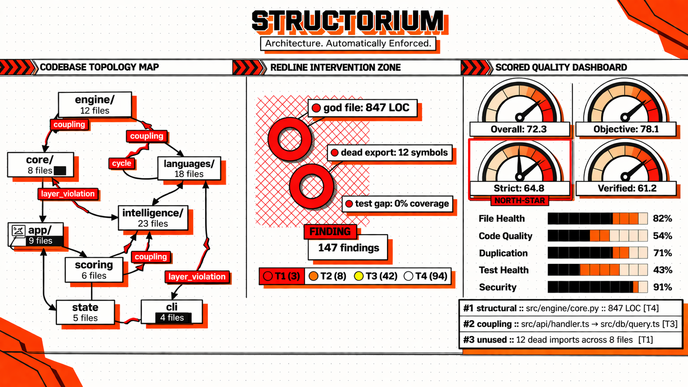
</p>

<h1 align="center">Structorium</h1>
<h3 align="center">Architecture. Automatically Enforced.</h3>

<p align="center">
  
  
  
  
  
  <a href="LICENSE"></a>
</p>

<p align="center">
  <b>Structorium is the operating system for codebase quality — built from the ground up for AI coding agents.</b><br/>
  It doesn't just find problems. It <b>remembers them, ranks them, tracks how you fix them, and blocks you from making new ones.</b><br/>
  Every scan builds on the last. Every fix is measured. Every regression is caught. This is not a linter — it's a quality runtime.
</p>

---

## What This Document Covers

This is not a typical README. This is the **complete operating manual** — a 2,000+ line technical book that covers every concept, every formula, every detector, and every operational scenario in Structorium. Read it front-to-back to understand the entire system, or jump to any section as a reference. By the time you finish, you'll understand Structorium better than most people understand their own codebases.

| If you want… | Go to… |
|:-------------|:-------|
| Quick install and first scan | [Installation](#-installation) → [First Scan](#-first-scan--fix-loop) |
| Understand the core workflow | [The Operating Loop](#-the-operating-loop) |
| Score math and anti-gaming mechanics | [Scoring Model](#-scoring-model-deep-dive) → [Anti-Gaming](#-anti-gaming-deep-dive) |
| Compare to SonarQube, CodeQL, etc. | [Competitive Positioning](#-competitive-positioning) |
| Full command reference | [Command Atlas](#-command-atlas) |
| All 28 languages and capabilities | [Language Coverage Atlas](#-language-coverage-atlas) |
| CI integration and enforcement | [New-Code Gate](#-new-code-gate) → [CI Integration](#-ci-integration-playbook) |
| Review system and AI context | [Review System](#-review-system-deep-dive) → [AI Context Layer](#-ai-context-layer) |
| Production playbooks | [Operator Scenarios](#-real-operator-scenarios) |

> **Estimated reading time**: ~45 minutes for the full document. ~10 minutes for quick start only.

---

## Storyboard

The 5-step operational flow, from codebase scan to CI enforcement.

<p align="center">
  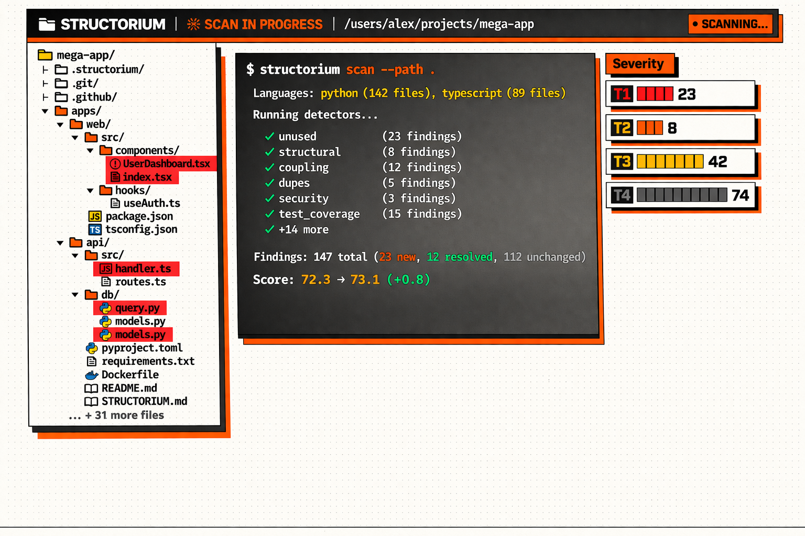
  <br/><br/>
  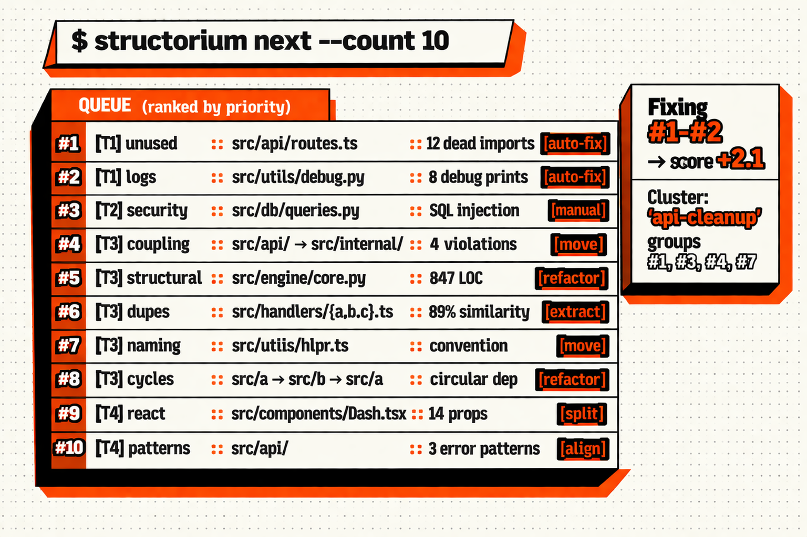
  <br/><br/>
  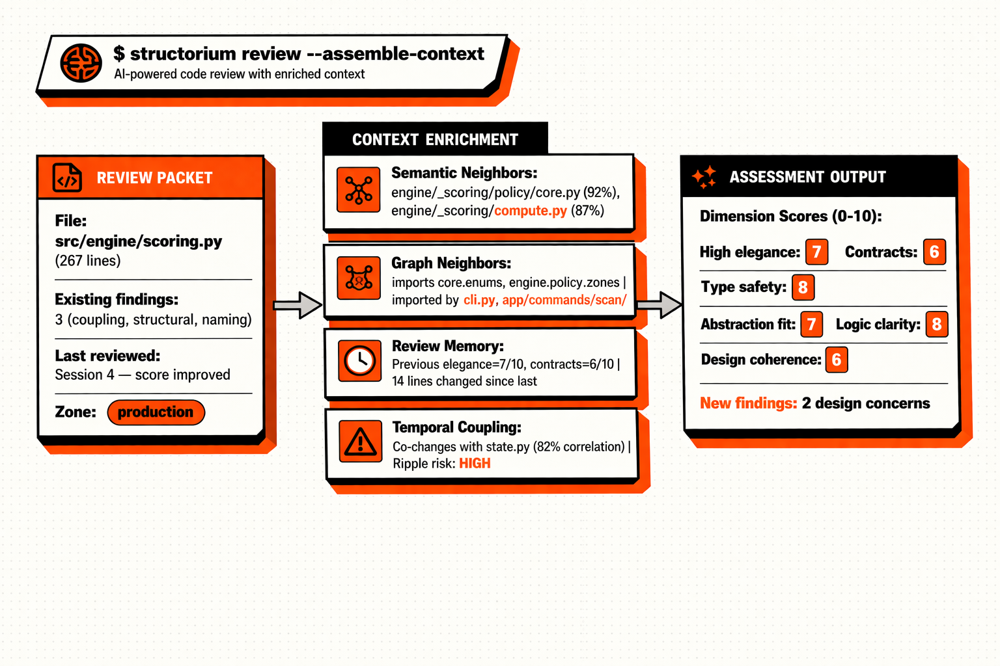
  <br/><br/>
  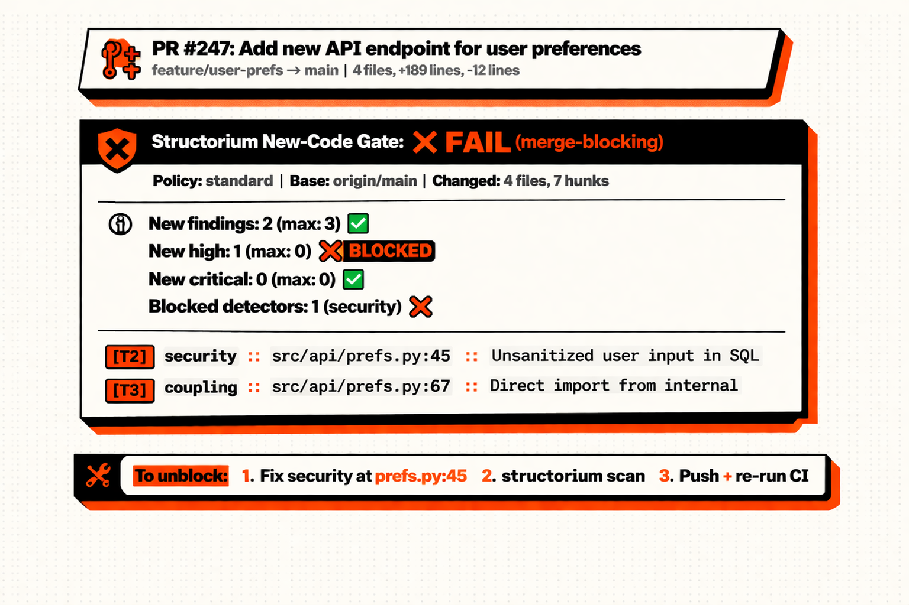
  <br/><br/>
  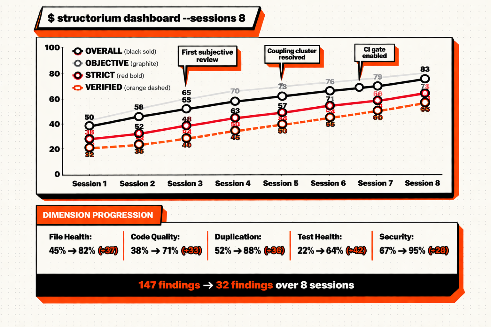
</p>

---

## Visual Architecture Pack

These diagrams are referenced throughout this document. Each one is explained in detail in its corresponding section.

| Diagram | Section | What It Shows |
|:--------|:--------|:-------------|
| [Operating Loop](assets/readme/operating_loop.png) | [Operating Loop](#-the-operating-loop) | The 7-stage scan → fix → gate cycle |
| [Scan Pipeline](assets/readme/scan_pipeline.png) | [Scan Deep Dive](#-scan-deep-dive) | How scan works with parallel detectors |
| [Scoring Model](assets/readme/scoring_model.png) | [Scoring Model](#-scoring-model-deep-dive) | 40/60 split, 4 score types, anti-gaming |
| [Plugin Architecture](assets/readme/plugin_architecture.png) | [Plugin Architecture](#-plugin-architecture) | 28 languages in 3 layers |
| [Review Pipeline](assets/readme/review_pipeline.png) | [Review System](#-review-system-deep-dive) | prepare → batch → validate → merge |
| [AI Context Stack](assets/readme/ai_context_stack.png) | [AI Context Layer](#-ai-context-layer) | 7-layer AI enrichment stack |
| [New-Code Gate](assets/readme/new_code_gate.png) | [New-Code Gate](#-new-code-gate) | CI enforcement with 3 policy profiles |
| [Fix/Resolve/Move](assets/readme/fix_resolve_move.png) | [Fix & Resolve](#-fix-resolve-move--anti-gaming) | Resolution paths + auto-fixers |
| [Language Atlas](assets/readme/language_atlas.png) | [Language Atlas](#-language-coverage-atlas) | 6 full + 22 generic capabilities |

---

## Table of Contents

<details>
<summary><b>Click to expand full table of contents (54 sections)</b></summary>

### Part 1 — First Impression
- [What This Document Covers](#what-this-document-covers)
- [Storyboard](#storyboard)
- [Visual Architecture Pack](#visual-architecture-pack)

### Part 2 — Orientation
- [What Structorium Is](#-what-structorium-is)
- [Why It Exists](#-why-it-exists)
- [Design Principles](#-design-principles)
- [Who This Is For](#-who-this-is-for)
- [What Makes It Different](#-what-makes-it-different)

### Part 3 — Quick Start & Activation
- [Installation](#-installation)
- [Agent Skill Installation](#-agent-skill-installation)
- [First Scan & Fix Loop](#-first-scan--fix-loop)
- [Agent Prompt Block](#-agent-prompt-block)

### Part 4 — The Operating Loop (Deep Dive)
- [The Operating Loop](#-the-operating-loop)
- [Scan Deep Dive](#-scan-deep-dive)
- [Next & Ranking Deep Dive](#-next--ranking-deep-dive)
- [Plan Deep Dive](#-plan-deep-dive)
- [Fix, Resolve, Move & Anti-Gaming](#-fix-resolve-move--anti-gaming)

### Part 5 — Review System
- [Review System Deep Dive](#-review-system-deep-dive)
- [Subjective Dimensions Reference](#-subjective-dimensions-reference)
- [AI Context Layer](#-ai-context-layer)

### Part 6 — Architecture Enforcement
- [New-Code Gate](#-new-code-gate)
- [Zone Classifications](#-zone-classifications)
- [CI Integration Playbook](#-ci-integration-playbook)

### Part 7 — Scoring Model (Deep Dive)
- [Scoring Model Deep Dive](#-scoring-model-deep-dive)
- [Score Composition Formula](#-score-composition-formula)
- [Anti-Gaming Deep Dive](#-anti-gaming-deep-dive)

### Part 8 — Plugin Architecture
- [Plugin Architecture](#-plugin-architecture)
- [Full Plugin Contract](#-full-plugin-contract)
- [Generic Plugin System](#-generic-plugin-system)
- [Shared Framework Deep Dive](#-shared-framework-deep-dive)
- [Language Coverage Atlas](#-language-coverage-atlas)

### Part 9 — Competitive Positioning
- [vs Traditional Linters](#-structorium-vs-traditional-linters)
- [vs Enterprise SAST](#-structorium-vs-enterprise-sast)
- [vs AI Code Review](#-structorium-vs-ai-code-review-tools)
- [vs AI Slop Catchers](#-structorium-vs-ai-slop-catchers)
- [AI Model Comparison](#-ai-model-comparison-matrix)

### Part 10 — Internals & Reference
- [Detector Registry](#-detector-registry--complete-reference)
- [Command Atlas](#-command-atlas)
- [Repository Structure](#-repository-structure)
- [Configuration Reference](#-configuration-reference)
- [State Schema Deep Dive](#-state-schema-deep-dive)

### Part 11 — Formula Appendix
- [Score Composition Formulas](#-score-composition-formulas)
- [Detection Pass Rate](#-detection-pass-rate)
- [New-Code Gate Logic](#-new-code-gate-threshold-logic)
- [Temporal Coupling](#-temporal-coupling)

### Part 12 — Operational Guides & Closure
- [Operator Scenarios](#-real-operator-scenarios)
- [Known Failure Modes](#-known-failure-modes--edge-cases)
- [Development & Contributing](#-development--contributing)
- [FAQ](#-faq)
- [Roadmap](#-roadmap)
- [License & Community](#-license--community)

</details>

---

<!-- ============================================================ -->
<!-- PART 2: ORIENTATION                                           -->
<!-- ============================================================ -->

# PART 2 — ORIENTATION

---

## 🔍 What Structorium Is

Structorium is a **CLI-native codebase quality operating system** (Python 3.11+) that gives AI coding agents — and the humans who work alongside them — something no other tool gives them: a **persistent, ranked, enforceable, anti-cheatable** view of codebase quality that compounds over time.

Forget "run a linter, get a list, close the terminal, forget everything." Structorium does **five things simultaneously** that no other single tool on the planet does:

| # | Capability | What It Means In Practice |
|:-:|:-----------|:-------------|
| 1 | **Detects** | 30+ detectors rip through your codebase across **3 parallel lanes** — mechanical (unused code, duplication, coupling, god files), security (bandit, semgrep, dependency audit), and subjective (12 AI-assessed quality dimensions). Nothing hides. |
| 2 | **Persists** | Every finding is written to `.structorium/state.json` and **never silently dropped**. Session 5 knows exactly what session 1 found, what you fixed, what you dismissed, and what regressed. This is memory, not noise. |
| 3 | **Ranks** | The `next` command always surfaces the **single highest-impact item to fix right now** — tier-weighted (T4 = 4× the weight of T1), confidence-adjusted, cluster-aware. You never waste time on low-impact items. |
| 4 | **Reviews** | AI-driven subjective review assesses **12 quality dimensions** that no linter can see — elegance, contracts, type safety, abstraction fit, design coherence, AI-generated debt. This contributes **60% of your overall score**. Architecture quality is not optional. |
| 5 | **Enforces** | A CI new-code gate **blocks regressions on changed lines** without requiring your entire legacy codebase to be perfect. Clean up old debt at your own pace. New code must be clean from day one. |

### What Structorium Is NOT

Let's kill misconceptions immediately:

| It is NOT… | Why Not |
|:-----------|:---------|
| **A linter replacement** | Structorium **contains** linters — it wraps ruff, bandit, knip, clippy, rubocop, and more. But a linter is a component inside Structorium, not the other way around. Structorium adds state, ranking, scoring, review, and enforcement **on top of every linter it wraps**. |
| **A one-shot code scanner** | One-shot scanners are amnesiac — they find 200 issues, you fix 10, close the terminal, and next time they find 200 issues again. Structorium **remembers**. It knows which 10 you fixed, which 3 regressed, and which 187 are still open. This is the difference between noise and intelligence. |
| **A formatting tool** | Formatting is solved. Prettier, Black, gofmt — done. Structorium operates at the **architecture level**: module boundaries, dependency cycles, god files, coupling violations, design coherence. The problems that actually kill projects. |
| **"Ask an LLM for vibes"** code review | Structorium's AI review is **structured** (12 explicit dimensions with weights), **fail-closed** (invalid reviews are rejected entirely), and **scored** (contributes to a persistent numeric quality metric). This is systematic assessment engineering, not chatbot opinions. |

---

## 💡 Why It Exists

### The Drift Problem

Every codebase rots. Not dramatically — **silently**. Even with linters, formatters, and type checkers running in every CI pipeline, the decay is relentless:

- **Dead code accumulates like sediment** — unused imports, orphaned files, deprecated symbols pile up one commit at a time. Nobody notices until the codebase is 30% dead weight.
- **Module boundaries dissolve** — coupling creeps in through private import violations and layer crossings. By the time someone says "why does the API layer import from the database internals?", it's already load-bearing.
- **God files metastasize** — files are easy to extend, hard to split. So `core.py` grows from 200 lines to 500, then 800, then 1,200. Every bug in that file is now a high-blast-radius event.
- **Test coverage lies to your face** — 80% coverage sounds great until you realize the 20% that's missing is the state transition logic, the error paths, and the edge cases. The hard parts.
- **Naming drifts from reality** — `helpers.ts` that isn't helpers. `utils/` that contains business logic. `temp_fix.py` that's been in production for 18 months.
- **Architecture patterns breed** — three error handling patterns. Two state management approaches. Four different API response formats. Each one made sense when it was written. Together, they're chaos.
- **AI-generated code adds invisible debt** — plausible-looking, compiles-fine code that violates every project convention, duplicates existing utilities, and introduces antipatterns that a senior engineer would catch in review but a linter never will.

Traditional tools catch **individual rule violations** — one file, one line, one warning. Nobody tracks the **compound decay across sessions**. Nobody ranks **what actually matters most**. Nobody blocks **regressions on new code while allowing legacy cleanup to happen at its own pace**.

Until Structorium.

### The Thesis

> **Code quality should be continuously visible, continuously rankable, and continuously actionable — not a quarterly audit checkbox that everyone lies about.**

Structorium turns "vibe coding" into **vibe engineering**: same velocity, same AI-augmented speed, but with **persistent quality measurement underneath that compounds across every session**. Every scan builds on the last. Every fix is tracked. Every regression is caught. Every attempt to game the score is detected.

This is not "run a linter and hope for the best." This is an operating system for quality.

---

## 🏗️ Design Principles

These aren't suggestions. These are the **six non-negotiable commitments** burned into every line of Structorium's architecture. Every design decision traces back to one of these:

| # | Principle | What It Means — No Exceptions |
|:-:|:----------|:-------------------------|
| 1 | **Findings become state, not terminal noise** | Every detected issue is written to `.structorium/state.json`. It persists across sessions, tracks resolution status, carries its full history, and is **never silently dropped**. If Structorium found it, it's tracked until you explicitly resolve it. The terminal is a view; the state file is the truth. |
| 2 | **Work is ranked, not dumped** | A flat list of 400 warnings is useless — it's a wall of noise that paralyzes instead of guiding. The `next` command always surfaces the **single highest-impact item**, ranked by tier weight (T1=1×, T2=2×, T3=3×, T4=4×), confidence-adjusted (high=1.0, medium=0.7, low=0.3), and cluster-aware. You always know exactly what to do next. |
| 3 | **Subjective quality is first-class** | Linters check rules. Rules don't catch "this abstraction is at the wrong level" or "this module has no clear boundary" or "this code was clearly AI-generated and follows none of our conventions." **12 dimensions assessed by AI review contribute 60% of the overall score.** Architecture quality is not optional — it's the majority of what matters. |
| 4 | **Trust boundaries are explicit and fail-closed** | You can't sneak bad data into Structorium's state. Review imports are **fail-closed** — if any finding in the import is invalid, incomplete, inconsistent, or skipped, the **entire import is aborted**. No partial results. No "well, most of it was fine." Either the review passes every validation check, or nothing gets imported. |
| 5 | **Score must resist gaming — aggressively** | People game metrics. Always. Structorium is built assuming you're trying to cheat: `wontfix` still hurts strict score (dismissing debt ≠ fixing debt). Scores landing within ±0.05 of a round target are **flagged as suspicious**. Attestation is required for resolution (you must describe what you actually did). Suspect detector drops are held, not auto-resolved. **A perfect score achieved dishonestly is worthless.** |
| 6 | **Enforcement must be operational, not aspirational** | The new-code gate blocks regressions in CI **on changed lines only**. This is critical: it means you can enable enforcement on a legacy codebase on day one. Legacy debt is not gated — clean it up at your own pace. But every new PR must meet the standard. Quality enforcement has to work in the real world, not just in greenfield fantasies. |

---

## 👥 Who This Is For

<details>
<summary><b>🤖 AI Agent Framework Developers</b></summary>

You're building the next generation of AI coding agents — Claude Code, Codex, Cursor, Copilot, Windsurf, Gemini — and you need them to produce **architecturally sound code**, not just code that compiles and passes tests. The problem: AI agents are phenomenally fast at generating code, and catastrophically indifferent to whether that code follows your project's conventions, respects module boundaries, or introduces coupling that will hurt you in 6 months.

Structorium gives your agent a **persistent quality model to work against**. The agent can scan, check its score, fix the highest-priority item, verify improvement, and repeat — autonomously. The agent skill system provides **ready-made skill documents for 7 different agents** that teach them the complete Structorium workflow out of the box.

**Key features for you**: Agent skill installation (`update-skill`), `next` command for autonomous quality loops, `plan` for work queue management, persistent state across sessions so the agent's progress compounds.
</details>

<details>
<summary><b>⚡ Solo Developers Using Vibe Coding Tools</b></summary>

You ship fast with AI assistance and it feels incredible — until one day you look at your codebase and realize you have three competing state management patterns, a `utils/` directory that's become a junk drawer, and 400 lines of dead imports. You don't need a lecture. You need a **measurable quality baseline** that tracks across sessions and tells you exactly what to fix first.

Structorium is your architectural safety net. The `next` command tells you the single most impactful thing to fix right now — no architectural expertise required. Six auto-fixers handle the boring stuff (unused imports, dead variables, stale console.logs) automatically. Score progression tracking lets you see — in real numbers — that your codebase is getting better session over session.

**Key features for you**: Auto-fixers (6 available), ranked `next` queue, score progression tracking, `status` dashboard for instant health check.
</details>

<details>
<summary><b>👥 Teams with Growing Codebases</b></summary>

Your codebase crossed the "one person can understand it" threshold. Coupling is creeping in through module boundaries nobody agreed on. God files are forming because nobody wants to be the one to refactor a 1,200-line file. Test coverage is 78% but the missing 22% is all the tricky edge-case logic. Code reviews are inconsistent — Person A catches coupling violations, Person B misses them entirely.

Structorium provides the **automated architectural visibility** that manual code review cannot sustain at scale. 30+ detectors run consistently, across every scan, every time. Nobody has a bad day. Nobody misses the coupling violation because they were reviewing at 4 PM on a Friday. And the CI new-code gate ensures that whatever you catch, you enforce.

**Key features for you**: CI new-code gate (blocks regressions, not legacy), zone classifications, cluster-based planning for sprint work, team review workflows.
</details>

<details>
<summary><b>📊 Engineering Leads Who Want Measurable Quality</b></summary>

Your CEO asks: "Is our code getting better or worse?" You want to say "better" but you actually have no idea. Code review coverage is inconsistent. Linter warnings are either ignored or auto-suppressed. Technical debt conversations devolve into vibes and opinions.

Structorium gives you **four score types** that are precise, formula-driven, resistant to gaming, and tracked over time. The **strict score** is your north-star metric — it can't be inflated by mass `wontfix` dismissals, it can't be gamed by suppressing linter rules, and it tracks improvement with real numbers across sessions. When your strict score goes from 45 to 72 over a quarter, you have evidence — not opinions.

**Key features for you**: Strict score as north-star metric, anti-gaming controls (5 mechanisms), dimension health breakdown, score progression across sessions.
</details>

<details>
<summary><b>🌐 Open Source Maintainers</b></summary>

Every open source maintainer's nightmare: a well-meaning contributor opens a PR that introduces 3 coupling violations, a security finding, and a layer violation — all in code that passes CI because your existing CI only checks formatting and tests. You catch it in review (if you're lucky and have the energy to review thoroughly), or it gets merged and becomes your problem.

Structorium's new-code gate **automatically blocks regressions on changed lines before you ever see the PR**. Contributors fix their own issues before merge. You set the policy (strict, standard, or AI-generated), and the gate does the rest. 28 languages supported out of the box.

**Key features for you**: New-code gate in CI, `standard` and `strict` policy profiles, 28-language support, zero-config auto-detection.
</details>

---

## ⚡ What Makes It Different

This is not incremental improvement on existing tools. This is a **category difference**.

| Differentiator | What Every Other Tool Does | What Structorium Does Instead |
|:--------------|:-------------------------|:---------------------|
| **Persistent state** | Each run starts fresh. Zero memory. Your Tuesday scan has no idea what Monday's scan found. You fix 10 things, rescan, and see the same 400 warnings. It's Groundhog Day for code quality. | Findings **survive across sessions** as tracked state. Session 5 knows exactly what session 1 found, which items you fixed, which you dismissed, which regressed, and which are new. This is the foundation for everything else. |
| **Ranked work queue** | Flat list of 400 warnings. Same severity. You scroll, pick something that looks easy, fix it, feel good, ignore the 399 remaining items that include 3 critical coupling violations buried on page 7. | `next` always surfaces the **single highest-impact item** — tier-weighted (T4 refactors = 4× the weight of T1 auto-fixes), confidence-adjusted, cluster-aware. You never have to decide what matters. The math decides. |
| **Subjective AI review** | Doesn't exist. Linters check rules. Nobody checks "does this abstraction make sense?" or "is the API shape intuitive?" or "is this module boundary coherent?" Those questions require judgment, and linters don't have any. | **12 quality dimensions** (elegance, contracts, type safety, abstraction fit, design coherence, AI debt, and more) assessed by structured AI review with fail-closed validation. This is **60% of your overall score** — because architecture quality is the majority of what matters. |
| **Anti-gaming scoring** | Pass/fail on rule counts. Add a `// nolint` comment, suppress the warning, score goes up. Disable 3 rules in the config, score goes up. Mark everything as "won't fix" in Jira, score goes up. None of the code actually improved. | `wontfix` **still hurts strict score** — the metric that matters. Scores landing suspiciously close to round targets are flagged. Attestation is required for resolution. Suspect detector drops are held for human review. **Structorium assumes you're trying to cheat and demands proof otherwise.** |
| **Architecture enforcement** | Block on any violation (impossible for legacy code) or block on nothing (useless). Binary choice that forces teams into either "ignore all warnings" or "spend 6 months cleaning up before you can turn on CI." | New-code gate blocks **only regressions on changed lines**. Turn it on day one on any legacy codebase. Legacy debt is not gated — clean it up at your own pace. But every new PR must be clean. This is how enforcement actually works in the real world. |

---

<!-- ============================================================ -->
<!-- PART 3: QUICK START & ACTIVATION                              -->
<!-- ============================================================ -->

# PART 3 — QUICK START & ACTIVATION

---

## 📦 Installation

### Core Install

```bash
python3 -m venv .venv && source .venv/bin/activate
pip install structorium
```

### Optional Extras

Structorium has a modular extras system. Install only what you need:

| Extra | What It Adds | Install Command |
|:------|:------------|:---------------|
| `treesitter` | Deeper AST analysis for 22 generic language plugins — function extraction, import parsing, complexity metrics, god class detection, AST smell detection | `pip install structorium[treesitter]` |
| `python-security` | Bandit security scanner for Python projects | `pip install structorium[python-security]` |
| `scorecard` | Badge and scorecard image generation for READMEs | `pip install structorium[scorecard]` |
| `ai` | Neo4j + Turbopuffer integration for AI-enriched review context (graph neighborhoods, vector similarity, temporal coupling) | `pip install structorium[ai]` |
| `full` | Everything above — all extras installed | `pip install structorium[full]` |

### Verify Installation

```bash
structorium --version
structorium langs          # list supported language plugins
```

---

## 🤖 Agent Skill Installation

Structorium ships with ready-made skill documents for 7 AI coding agents. The skill document teaches your agent how to use Structorium effectively — scan, interpret findings, fix, resolve, and review.

```bash
structorium update-skill <agent>
```

| Agent | Command | What It Creates |
|:------|:--------|:---------------|
| Claude Code | `structorium update-skill claude` | `.claude/structorium.md` |
| Cursor | `structorium update-skill cursor` | `.cursor/rules/structorium.mdc` |
| GitHub Copilot | `structorium update-skill copilot` | `.github/copilot-instructions.md` (appended) |
| Windsurf (Codeium) | `structorium update-skill windsurf` | `.windsurf/rules/structorium.md` |
| Gemini Code Assist | `structorium update-skill gemini` | `.gemini/structorium.md` |
| OpenAI Codex CLI | `structorium update-skill codex` | `codex.md` or `AGENTS.md` (appended) |
| OpenCode | `structorium update-skill opencode` | `.opencode/structorium.md` |

The skill is versioned and idempotent — running `update-skill` again updates to the latest version without duplicating content.

---

## 🚀 First Scan & Fix Loop

This walkthrough takes you through the complete Structorium workflow in 6 commands. After this, you'll understand **state, queue, score, and the operating loop**.

### Step 1: Scan Your Codebase

```bash
structorium scan --path .
```

This runs 30+ detectors across your codebase, auto-detects languages, merges findings into persistent state, and computes all four score types. Output shows:
- Finding counts by detector
- New vs unchanged vs resolved counts
- Score change from previous scan (if any)
- Dimension health breakdown

### Step 2: Check Your Status

```bash
structorium status
```

The status dashboard shows your current scores, dimension health bars, finding counts by tier, and score progression trend.

### Step 3: Get Your Highest-Priority Fix

```bash
structorium next
```

Structorium surfaces the single highest-impact item to fix right now — ranked by tier weight, confidence, and cluster priority. The output includes:
- Finding ID, detector, file, and line
- Tier and confidence
- Guidance: what to do and why
- Available fixers (if auto-fixable)

### Step 4: Fix It

For auto-fixable issues (T1):
```bash
structorium fix unused-imports
```

For manual fixes: make the change yourself, then resolve:
```bash
structorium plan done "unused::src/api/routes.ts::React" \
  --note "removed unused React import" \
  --attest "I have actually removed this import and verified the file still compiles"
```

> **Why attestation?** Structorium requires you to attest that the fix was actually applied. This prevents drive-by `done` commands that game the score without doing real work.

### Step 5: Get the Next Item

```bash
structorium next
```

The queue has advanced. A new highest-priority item is surfaced. Repeat steps 3-5 until you've addressed your target items.

### Step 6: Rescan to Verify

```bash
structorium scan --path .
```

The rescan picks up your fixes, resolves findings that are genuinely gone, detects any regressions, and recomputes all scores. You should see your scores improve.

### What You Now Understand

After this loop, you've experienced:
- **State**: findings persist in `.structorium/state.json`
- **Queue**: `next` always gives you the highest-impact item
- **Score**: four score types that resist gaming
- **Loop**: scan → next → fix → resolve → rescan → repeat

---

## 📋 Agent Prompt Block

Copy-paste this into your AI agent's prompt to give it full Structorium awareness:

```
You have access to the Structorium codebase quality tool. Use it to maintain
architectural quality as you work.

WORKFLOW:
1. Run `structorium scan --path .` to detect issues
2. Run `structorium next` to get the highest-priority item
3. Fix the issue
4. Run `structorium plan done "<id>" --note "<what>" --attest "I have actually <verified>"` to resolve
5. Run `structorium next` for the next item
6. After fixes, run `structorium scan --path .` to verify improvement

KEY COMMANDS:
- `structorium status` — score dashboard
- `structorium next --count 5` — top 5 priorities
- `structorium show <file>` — findings for a specific file
- `structorium tree` — annotated codebase tree
- `structorium fix <fixer>` — auto-fix (unused-imports, unused-vars, unused-params, debug-logs, dead-useeffect, empty-if-chain)
- `structorium plan` — full ranked plan
- `structorium plan cluster create <name>` — group related issues
- `structorium review --prepare` — prepare subjective review packet

SCORE TYPES (track all four):
- Overall: broad health (failures = open)
- Objective: mechanical only (failures = open)
- Strict ⭐: north-star metric (failures = open + wontfix)
- Verified strict: highest confidence (failures = open + wontfix + fixed + false_positive)

RULES:
- Always attest your fixes honestly
- wontfix still hurts strict score — don't dismiss issues casually
- Run scan after significant changes to track improvement
- Use `next` to stay focused — don't cherry-pick easy wins
```

---

<!-- ============================================================ -->
<!-- PART 4: THE OPERATING LOOP — DEEP DIVE                        -->
<!-- ============================================================ -->

# PART 4 — THE OPERATING LOOP

---

## 🔄 The Operating Loop

<p align="center">
  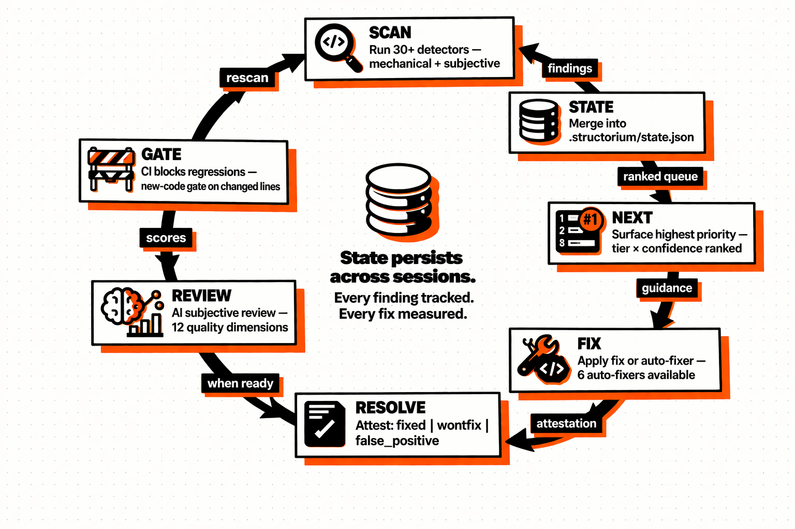
</p>

Structorium operates as a **continuous improvement loop** with 7 stages. This isn't a linear pipeline — it's a **flywheel**. Each stage feeds the next, state persists across sessions, and progress compounds over time. The more you use it, the smarter and more valuable it becomes.

Think of it as the quality equivalent of a CI/CD pipeline: just as CI/CD made "ship and pray" obsolete for deployments, the operating loop makes "lint and forget" obsolete for architecture quality.

| Stage | Command | What Happens | What Changes in State |
|:------|:--------|:------------|:---------------------|
| **1. SCAN** | `structorium scan` | 30+ detectors run across all files in **3 parallel lanes** — mechanical, security, subjective. Languages auto-detected across 28 plugins. Every file is classified, analyzed, and scored. | New findings added. Resolved findings marked. All four score types recomputed. |
| **2. STATE** | *(automatic)* | Findings merged into `.structorium/state.json` using merge semantics — not replacement. New findings added, existing findings preserved with updated timestamps, genuinely-gone findings resolved. Suspect detector drops are **held**, not auto-resolved. | State file updated. History preserved. Nothing lost. |
| **3. NEXT** | `structorium next` | Priority queue does the thinking for you. Surfaces the **single highest-impact item** — ranked by tier weight × confidence × cluster focus. This is the command AI agents call in autonomous loops. | Nothing changes — `next` is read-only. Pure query. |
| **4. FIX** | `structorium fix` or manual | Auto-fixer runs (6 available for T1 items), or you make the change manually. This is where code actually changes. | Source code changed. State unchanged until rescan. |
| **5. RESOLVE** | `structorium plan done` | You attest the resolution: `fixed`, `wontfix`, or `false_positive`. Note and attestation **required** — you must describe what you actually did. No drive-by closures. | Finding status updated in state. Queue reranked. Scores reflect new resolution. |
| **6. REVIEW** | `structorium review` | AI subjective review assesses 12 quality dimensions with **fail-closed import validation**. If any finding is invalid, skipped, or inconsistent — the entire import is rejected. No partial results contaminate state. | Subjective scores updated. 60% of overall score affected. |
| **7. GATE** | CI integration | New-code gate evaluates changed lines against policy thresholds. Three profiles (strict/standard/ai_generated). Pass or fail — and fail is **merge-blocking**. | Gate status recorded. Regressions blocked before they enter the codebase. |

> **The key insight**: Remove any one stage and the system degrades. Without persistence, you lose continuity — every session starts from zero. Without ranking, you lose focus — you cherry-pick easy wins and ignore critical issues. Without subjective review, you lose depth — linters can't see architecture. Without strictness, you lose honesty — people game the metric. Without the gate, you lose enforcement — quality becomes optional. All seven stages are load-bearing.

---

## 🔬 Scan Deep Dive

<p align="center">
  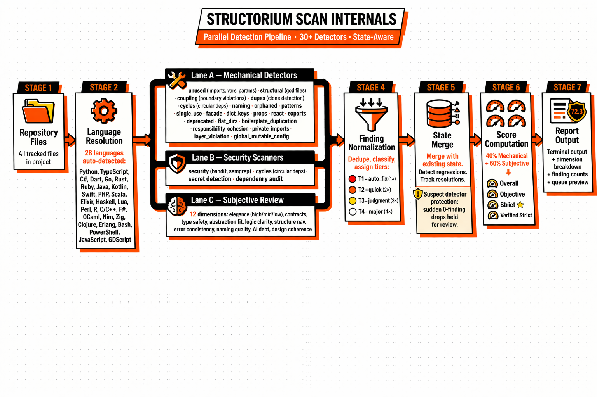
</p>

### What Scan Does (8 Steps)

When you run `structorium scan --path .`, the following happens in order:

| Step | What Happens | Key Detail |
|:-----|:------------|:-----------|
| 1 | **Discover files** | Walk the project tree, apply exclusions and zone classifications |
| 2 | **Resolve languages** | Auto-detect language for each file. 28 languages supported. Configurable via `--lang` |
| 3 | **Run mechanical detectors** | Parallel execution of 25+ mechanical detectors: unused, structural, coupling, dupes, cycles, naming, orphaned, patterns, etc. |
| 4 | **Run security scanners** | Language-specific security tools (bandit for Python, semgrep rules, etc.) |
| 5 | **Run subjective review** | If configured, assess 12 quality dimensions via AI review |
| 6 | **Normalize findings** | Deduplicate, classify by tier (T1-T4), assign confidence (high/medium/low) |
| 7 | **Merge into state** | Compare new findings with existing state. Add new, preserve existing, resolve genuinely-gone |
| 8 | **Compute scores** | Calculate all four score types across all dimensions |

### Scan Profiles

| Profile | Flag | What Runs | Use Case |
|:--------|:-----|:---------|:---------|
| `objective` | `--profile objective` | Mechanical detectors only. No subjective review. | Fast quality snapshot |
| `full` | *(default)* | All detectors including subjective if configured | Complete analysis |
| `ci` | `--profile ci` | All detectors + new-code gate evaluation | CI/CD pipeline integration |

### Suspect Detector Protection

If a detector that previously reported 40 findings suddenly reports 0, Structorium does **not** silently mark them all as resolved. Instead:

- The sudden-drop event is flagged as **suspect**
- Previous findings are **held** in state, not auto-resolved
- A warning is emitted in scan output
- This prevents tool misconfiguration or environment issues from silently inflating scores

### Optional Tool Degradation

When an external tool (e.g., `bandit`, `knip`, `rubocop`) is not installed:

- Structorium does **not** crash or skip the entire language
- The affected detector runs with **reduced confidence**
- Findings are still generated from available sources
- A warning is emitted noting the missing tool

### Key Scan Flags

| Flag | What It Does |
|:-----|:------------|
| `--path <dir>` | Scan a specific directory (default: current directory) |
| `--lang <lang>` | Force a specific language (skip auto-detection) |
| `--profile <name>` | Scan profile: `objective`, `full`, `ci` |
| `--skip-slow` | Skip long-running detectors for faster iteration |
| `--exclude <pattern>` | Exclude path pattern (repeatable) |

> **Source**: [`app/commands/scan/scan_workflow.py`](app/commands/scan/scan_workflow.py), [`app/commands/scan/scan_reporting_dimensions.py`](app/commands/scan/scan_reporting_dimensions.py)

---

## 📊 Next & Ranking Deep Dive

### How `next` Decides

The `next` command doesn't just return the first finding — it computes a **priority score** for every open finding and surfaces the highest:

| Factor | How It Affects Ranking |
|:-------|:---------------------|
| **Tier weight** | T1 (auto_fix) = 1×, T2 (quick_fix) = 2×, T3 (judgment) = 3×, T4 (major_refactor) = 4× |
| **Confidence** | High = 1.0, Medium = 0.7, Low = 0.3 |
| **Detector type** | Detectors with available auto-fixers are surfaced earlier for quick wins |
| **Cluster focus** | If a cluster is focused (`plan focus <cluster>`), only items in that cluster appear |
| **Review weighting** | Items with subjective review findings get boosted priority |

### Why Guidance Quality Matters

Every finding in `next` output includes **guidance** — a human-readable explanation of what to do and why. This is critical for AI agents that need actionable instructions, not just a finding name.

Example `next` output:
```
#1 [T3] coupling :: src/api/handler.ts → src/internal/auth.ts
   Guidance: fix boundary violations with `structorium move`
   Tool: move
   Confidence: high
   Cluster: api-cleanup
```

### `next` Command Variants

| Command | What It Shows |
|:--------|:-------------|
| `structorium next` | Single highest-priority item with full detail |
| `structorium next --explain` | Extended reasoning for the priority decision |
| `structorium next --tier 3` | Only judgment-tier items (filter by tier) |
| `structorium next --cluster <name>` | Only items in a specific cluster |
| `structorium next --count 5` | Top 5 items in ranked order |

> **Source**: [`engine/_work_queue/ranking.py`](engine/_work_queue/ranking.py), [`engine/_work_queue/core.py`](engine/_work_queue/core.py)

---

## 📋 Plan Deep Dive

The `plan` command gives you **full control over the work queue**. It's the workflow control surface for managing priorities, grouping related issues, and tracking progress.

### All Plan Operations

| Operation | Command | What It Does |
|:----------|:--------|:------------|
| **View plan** | `structorium plan` | Full prioritized markdown of all open findings |
| **View queue** | `structorium plan queue` | Compact table of all open items |
| **Mark done** | `structorium plan done "<id>" --note "..." --attest "..."` | Resolve a finding with attestation |
| **Move to top** | `structorium plan move "<pat>" top` | Reorder — push an item to the front |
| **Create cluster** | `structorium plan cluster create <name>` | Group related findings by name |
| **Focus cluster** | `structorium plan focus <cluster>` | `next` only returns items from this cluster |
| **Unfocus** | `structorium plan unfocus` | Remove cluster focus |
| **Defer** | `structorium plan defer "<pat>"` | Push item to the back of the queue |
| **Skip** | `structorium plan skip "<pat>"` | Hide from `next` (still in state) |
| **Reopen** | `structorium plan reopen "<pat>"` | Reopen a resolved finding |

### Work Queue as a Workflow Surface

The plan isn't just a list — it's a **workflow management tool**:

- **Clusters** group related issues. E.g., create `api-cleanup` cluster for all API boundary violations, then `plan focus api-cleanup` to work through them systematically.
- **Focus** scopes `next` to a single cluster — useful for sprint planning or deep-dive sessions.
- **Defer/skip** let you manage noise without dismissing issues — deferred items return to the queue later, skipped items stay in state but don't appear in `next`.

> **Source**: [`engine/planning/`](engine/planning/), [`app/commands/plan/`](app/commands/plan/)

---

## 🔧 Fix, Resolve, Move & Anti-Gaming

<p align="center">
  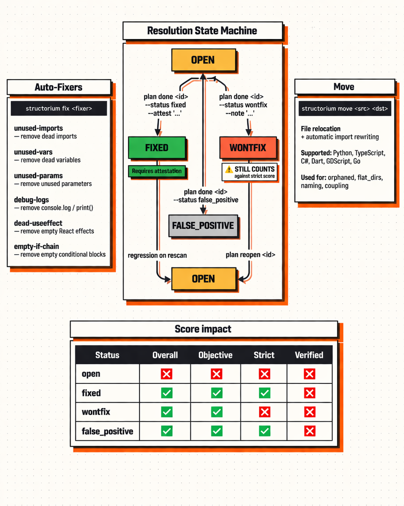
</p>

### Auto-Fixers

Structorium ships with **6 auto-fixers** that handle T1 (auto_fix tier) items automatically:

| Fixer | What It Does | Target Detector |
|:------|:------------|:---------------|
| `unused-imports` | Removes dead import statements | `unused` |
| `unused-vars` | Removes unused variable declarations | `unused` |
| `unused-params` | Removes unused function parameters | `unused` |
| `debug-logs` | Removes `console.log`, `print()`, `debug()` statements | `logs` |
| `dead-useeffect` | Removes empty React `useEffect` hooks | `smells` |
| `empty-if-chain` | Removes empty `if`/`else` blocks | `smells` |

Usage:
```bash
structorium fix unused-imports          # fix one type
structorium fix unused-imports --dry    # preview changes without applying
```

### Resolution Statuses

Every finding has a **resolution status** that determines how it affects each score type:

| Status | How You Set It | What It Means |
|:-------|:-------------|:-------------|
| `open` | *(default — set by scan)* | Finding is active and unresolved |
| `fixed` | `plan done "<id>" --status fixed --attest "..."` | You fixed the issue and attested to it |
| `wontfix` | `plan done "<id>" --status wontfix --note "..."` | You're deliberately not fixing it — and you know it hurts strict score |
| `false_positive` | `plan done "<id>" --status false_positive` | The detector was wrong — this isn't actually an issue |

### How Resolution Status Affects Scores

This is the **most important table in this document** for understanding Structorium's scoring philosophy:

| Status | Overall | Objective | Strict ⭐ | Verified Strict |
|:-------|:--------|:---------|:---------|:---------------|
| `open` | ❌ Fails | ❌ Fails | ❌ Fails | ❌ Fails |
| `fixed` | ✅ Passes | ✅ Passes | ✅ Passes | ❌ Fails |
| `wontfix` | ✅ Passes | ✅ Passes | ❌ **Fails** | ❌ Fails |
| `false_positive` | ✅ Passes | ✅ Passes | ✅ Passes | ❌ Fails |

> **Key insight**: `wontfix` passes overall/objective but **still fails strict score**. This is by design — dismissing debt is not the same as fixing it. The strict score is the north-star metric because it cannot be gamed by mass `wontfix` dismissals.

### Move — Repository Surgery

The `move` command relocates files and **automatically rewrites all import references** across the codebase:

```bash
structorium move src/utils/helpers.ts src/lib/string-utils.ts
```

This:
1. Moves the file to the new location
2. Updates every import across the project that referenced the old path
3. Language-aware path resolution (handles relative/absolute imports)
4. Works for: `orphaned`, `flat_dirs`, `naming`, `coupling`, `facade` detector findings

**Supported languages for move**: Python, TypeScript, C#, Dart, GDScript, Go

### Anti-Gaming Philosophy

Structorium is designed to be **gamed-resistant** by default. Five mechanisms prevent score inflation without real improvement:

| Mechanism | How It Works |
|:----------|:------------|
| **Wontfix penalty** | `wontfix` passes overall but FAILS strict score. Mass dismissal shows up immediately. |
| **Attestation requirement** | `plan done` requires `--attest` for `fixed` status. You must describe what you actually did. |
| **Target match detection** | Subjective scores within ±0.05 of target are flagged as potential gaming. `SUBJECTIVE_TARGET_MATCH_TOLERANCE = 0.05` |
| **Fail-closed review import** | If any finding in a review import is invalid, skipped, or inconsistent, the **entire import is aborted**. No partial results. |
| **Suspect detector drops** | If a detector suddenly reports 0 findings (down from 40+), the drop is held for review rather than auto-resolving. |

> **The philosophy**: A perfect score achieved dishonestly is useless. Structorium's scoring is strict-first — the system assumes you're trying to cheat and requires proof otherwise. This makes genuinely good scores trustworthy.

> **Source**: [`engine/_scoring/policy/core.py`](engine/_scoring/policy/core.py), [`intelligence/integrity.py`](intelligence/integrity.py)

---

<!-- ============================================================ -->
<!-- PART 5: REVIEW SYSTEM                                         -->
<!-- ============================================================ -->

# PART 5 — REVIEW SYSTEM

---

## 📝 Review System Deep Dive

<p align="center">
  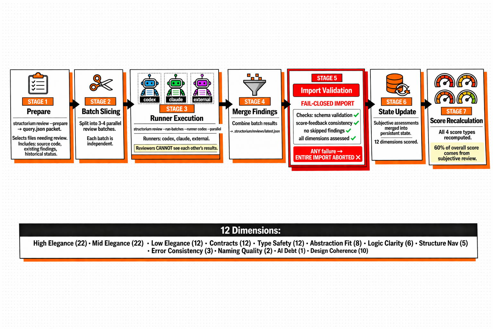
</p>

### Why Mechanical Evidence Is Not Enough

Here's the uncomfortable truth about linters: **they can only see what can be expressed as rules.** And the most important quality properties of a codebase — the ones that determine whether your project survives its second year or collapses under its own weight — cannot be expressed as rules.

| Property | Can a Linter See It? | Can Structorium Review See It? |
|:---------|:------|:------|
| Is this abstraction at the right level — or is it over-engineered / under-engineered? | ❌ Impossible | ✅ |
| Does the error handling pattern make architectural sense? | ❌ Impossible | ✅ |
| Is this API shape intuitive to a new developer? | ❌ Impossible | ✅ |
| Does this module have clear, documented boundaries? | ❌ Impossible | ✅ |
| Is the naming consistent with the rest of the project conventions? | ⚡ Partially | ✅ |
| Does the overall design cohere — or are there 3 competing patterns? | ❌ Impossible | ✅ |
| Does this code look like it was generated by AI and pasted without review? | ❌ Impossible | ✅ |

This is why Structorium gives **60% of the overall score to subjective review** — not as a nice-to-have, but as the **majority signal**. Architecture quality matters more than any individual rule violation. A codebase that passes every lint rule but has incoherent module boundaries, inconsistent patterns, and brittle abstractions is a ticking time bomb.

### The Three-Step Review Workflow

```bash
# Step 1: Prepare the review packet
structorium review --prepare
# Creates: .structorium/reviews/query.json
# Contains: source code, existing findings, historical status per file

# Step 2: Run review batches with an AI runner
structorium review --run-batches --runner codex --parallel
# Splits files into 3-4 independent batches
# Each batch assessed by the runner in isolation
# Runners: codex, claude, external

# Step 3: Import results under integrity constraints
structorium review --import .structorium/reviews/latest.json
# Validates schema, consistency, completeness
# ANY failure → ENTIRE import aborted (fail-closed)
```

### Fail-Closed Import Validation

When you import review results, Structorium validates **every field** before accepting:

| Check | What It Validates | On Failure |
|:------|:-----------------|:-----------|
| Schema validation | JSON structure matches expected format | ❌ Full import aborted |
| Score-feedback consistency | Scores align with written assessments | ❌ Full import aborted |
| Completeness | All requested files were assessed | ❌ Full import aborted |
| Dimension coverage | All 12 dimensions have scores | ❌ Full import aborted |
| No skipped findings | Every existing finding was addressed | ❌ Full import aborted |

> **Why fail-closed?** Partial review results would create inconsistent state — some files scored, others not. This would make the overall score meaningless. Better to reject and re-run than to accept incomplete data.

### External Review Sessions

For review runners that aren't directly integrated (e.g., Claude cloud):

```bash
structorium review --external-start --external-runner claude
# Generates the review packet for external processing
# You paste the packet into Claude, get assessments back
# Then import the results
```

### Review with Retrospective Context

The `--retrospective` flag includes historical issue status in the review packet, so the reviewer sees what changed since the last assessment:

```bash
structorium review --prepare --retrospective
```

> **Source**: [`app/commands/review/cmd.py`](app/commands/review/cmd.py), [`app/commands/review/prepare.py`](app/commands/review/prepare.py), [`app/commands/review/batches.py`](app/commands/review/batches.py), [`app/commands/review/import_cmd.py`](app/commands/review/import_cmd.py)

---

## 📐 Subjective Dimensions Reference

Structorium's subjective review assesses **12 quality dimensions**, each with a specific weight that determines its contribution to the subjective score pool (60% of overall):

| Dimension | Weight | What It Assesses |
|:----------|:------:|:----------------|
| **High elegance** | 22.0 | Top-tier files: are they simple, clear, beautifully structured? Would a senior engineer admire this code? |
| **Mid elegance** | 22.0 | Average files: decent organization, readable, follows conventions — but not exceptional |
| **Low elegance** | 12.0 | Bottom-tier files: messy, confusing, friction-heavy. Pain to work in. |
| **Contracts** | 12.0 | Interface clarity — are API surfaces well-defined? Are module boundaries respected? |
| **Type safety** | 12.0 | Type discipline — are types precise and meaningful, or loose and permissive? |
| **Abstraction fit** | 8.0 | Is the abstraction level right for the problem? Over-abstracted? Under-abstracted? |
| **Logic clarity** | 6.0 | Control flow readability — are conditionals clear? Are state transitions understandable? |
| **Structure navigation** | 5.0 | File/module layout — can you find what you need? Is the project navigable? |
| **Error consistency** | 3.0 | Error handling patterns — are they consistent? Are edge cases covered? |
| **Naming quality** | 2.0 | Identifier naming — are names clear, consistent, and convention-following? |
| **AI generated debt** | 1.0 | AI-specific debt — patterns typical of AI-generated code (plausible but wrong, duplicated utilities, convention violations) |
| **Design coherence** | 10.0 | Architectural coherence — does the overall design make sense? Are patterns consistent across modules? |

### Why These Weights?

The weights emphasize **elegance** (44.0 combined for high + mid) and **contracts/type safety** (24.0 combined) because these are the most impactful quality properties:

- **Elegance** determines whether code is a joy or a nightmare to modify
- **Contracts and types** determine whether modules can be safely composed
- **Design coherence** catches systemic problems that don't show up as individual findings

Lower-weight dimensions (naming, AI debt) are still assessed — they just don't dominate the score because a badly-named file with great structure is still better than a well-named file with terrible architecture.

> **Source**: [`engine/_scoring/policy/core.py`](engine/_scoring/policy/core.py) (lines 163-178)

---

## 🧠 AI Context Layer

<p align="center">
  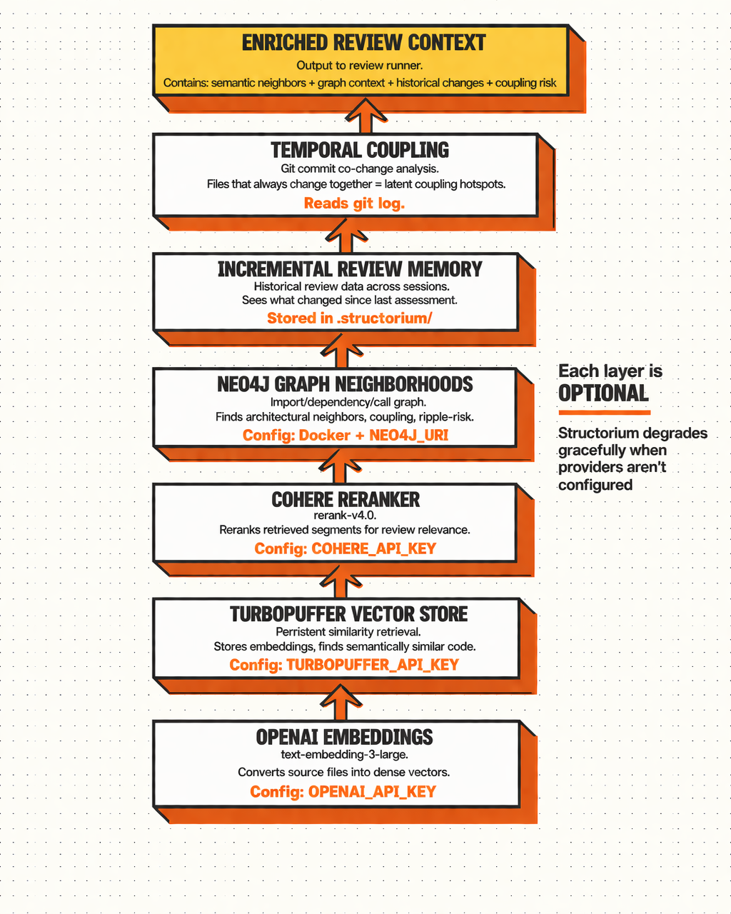
</p>

A human code reviewer doesn't just read the file in front of them. They bring **years of context** — they know which files tend to break together, which modules are frequently imported, what the codebase looked like 6 months ago. Structorium's AI context layer replicates this by enriching every review packet with **6 layers of intelligence** that transform raw source code into deeply contextualized review input.

### The Provider Stack

| Layer | Provider | What It Does | Config Key |
|:------|:---------|:------------|:-----------|
| 1 | **OpenAI** | Generates dense vector embeddings of source files | `OPENAI_API_KEY` + `ai_embedding_model` |
| 2 | **Turbopuffer** | Stores vectors persistently. Retrieves semantically similar code segments. | `TURBOPUFFER_API_KEY` |
| 3 | **Cohere** | Reranks retrieved segments for relevance to the review context | `COHERE_API_KEY` + `ai_reranker_model` |
| 4 | **Neo4j** | Graph database storing import/dependency/call relationships. Finds architectural neighbors and ripple-risk zones. | `NEO4J_URI`, `NEO4J_USERNAME`, `NEO4J_PASSWORD` |
| 5 | **Review Memory** | Historical review data persisted across sessions. Reviewer sees what changed since last assessment. | Automatic (`.structorium/`) |
| 6 | **Temporal Coupling** | Analyzes git commit history for co-change patterns. Files that always change together = latent coupling. | Automatic (`git log`) |

### What Each Layer Contributes to Review Context

| Layer | Example Enrichment |
|:------|:------------------|
| **Semantic neighbors** | "This file is 92% similar to `engine/_scoring/compute.py` — review for consistency" |
| **Graph neighbors** | "This module is imported by 14 files — changes here have high ripple risk" |
| **Review memory** | "Last reviewed in session 4: elegance was 7/10, contracts 6/10. 14 lines changed since." |
| **Temporal coupling** | "This file co-changes with `state.py` 82% of the time — likely latent coupling" |

### Graceful Degradation

Every layer is **optional**. If a provider isn't configured, Structorium skips that enrichment layer and continues with whatever context is available:

| Configuration | What You Get |
|:-------------|:------------|
| No API keys at all | Basic review with source code only — still functional |
| OpenAI only | Embeddings + similarity for semantic neighbors |
| OpenAI + Cohere | Similarity + reranking for more relevant context |
| OpenAI + Cohere + Turbopuffer | All above + persistent vector storage |
| Full stack (+ Neo4j) | All above + graph neighborhoods + temporal coupling |

### Setup

```bash
# API keys (set in environment or via config)
structorium config set OPENAI_API_KEY sk-...
structorium config set COHERE_API_KEY ...
structorium config set TURBOPUFFER_API_KEY ...

# Neo4j (via Docker Compose)
docker compose -f docker-compose.neo4j.yml up -d
structorium config set NEO4J_URI bolt://localhost:7687
structorium config set NEO4J_USERNAME neo4j
structorium config set NEO4J_PASSWORD <password>
```

> **Source**: [`intelligence/ai/`](intelligence/ai/), [`docs/AI_STACK.md`](docs/AI_STACK.md)

---

<!-- ============================================================ -->
<!-- PART 6: ARCHITECTURE ENFORCEMENT                              -->
<!-- ============================================================ -->

# PART 6 — ARCHITECTURE ENFORCEMENT

---

## 🚧 New-Code Gate

<p align="center">
  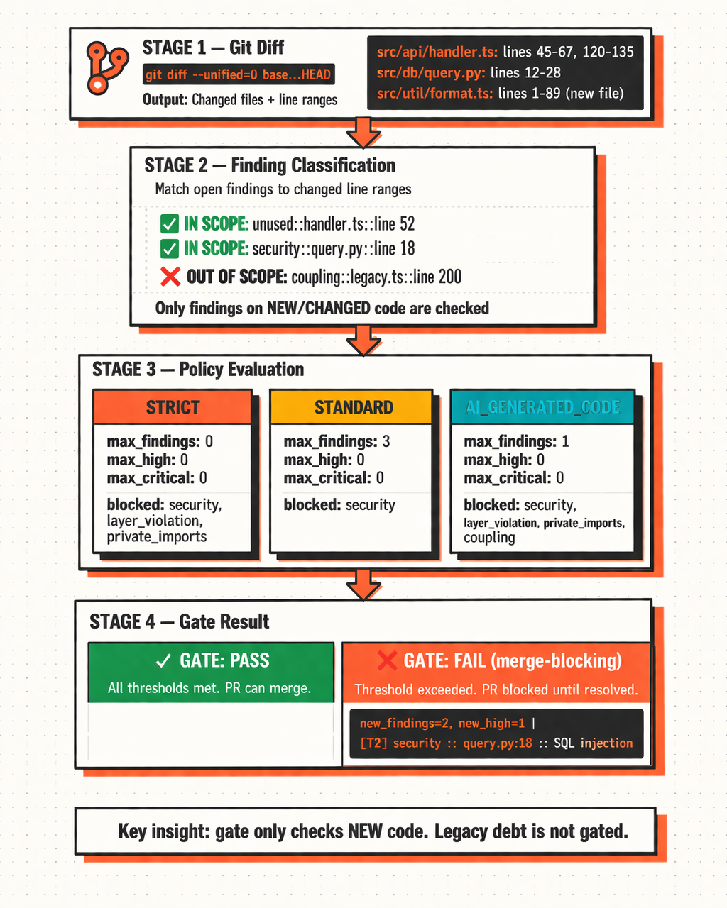
</p>

### The Concept

The new-code gate solves the most common excuse in software engineering: **"We can't turn on quality enforcement because our legacy code has too many issues."**

Every other quality gate forces you into a binary choice:
1. **Block on everything** — which means your 500-finding legacy codebase can never pass CI, which means you never turn on enforcement, which means quality stays optional forever.
2. **Block on nothing** — which means the gate is decorative. It exists. It does nothing. Warnings pile up.

Structorium's new-code gate takes a different approach: **it only evaluates findings on changed lines**. Legacy debt is not gated. You clean it up at your own pace, when you choose, on your timeline. But every new PR — every piece of new code your team writes or your AI agent generates — must meet the quality standard. From day one. No exceptions.

### How It Works (4 Steps)

| Step | What Happens |
|:-----|:------------|
| 1. **Git diff** | Compute changed file + line ranges from `git diff --unified=0 base...HEAD` |
| 2. **Classify** | Match open findings against changed line ranges — only findings on new/changed code are "in scope" |
| 3. **Policy check** | Compare in-scope findings against policy thresholds (max findings, max high, max critical, blocked detectors) |
| 4. **Result** | Pass (PR can merge) or Fail (merge-blocking — findings must be resolved first) |

### Three Policy Profiles

Structorium ships with three built-in policy profiles. Each has different threshold strictness:

| Policy | `max_new_findings` | `max_new_high` | `max_new_critical` | Blocked Detectors | Use Case |
|:-------|:------------------:|:-------------:|:-----------------:|:-------------------|:---------|
| `strict` | 0 | 0 | 0 | `security`, `layer_violation`, `private_imports` | Zero tolerance for new issues |
| `standard` | 3 | 0 | 0 | `security` | Reasonable for most teams |
| `ai_generated_code` | 1 | 0 | 0 | `security`, `layer_violation`, `private_imports`, `coupling` | Tighter control on AI-generated PRs |

### Blocked Detectors

Some detectors are **always blocked** regardless of threshold — if any new finding matches a blocked detector, the gate fails immediately:

- `security` — security findings on new code are never acceptable
- `layer_violation` — new architectural violations break the dependency structure
- `private_imports` — new private imports create hidden coupling
- `coupling` — (in `ai_generated_code` profile) AI agents tend to create coupling

### Configuration

```bash
# Enable the gate
structorium config set new_code_gate_enabled true

# Set policy profile
structorium config set new_code_gate_policy strict

# Override individual thresholds
structorium config set new_code_gate_max_new_findings 0
structorium config set new_code_gate_max_new_high 0
structorium config set new_code_gate_max_new_critical 0

# Set base ref for diff
# Default: origin/main
structorium config set new_code_gate_base_ref origin/develop
```

> **Source**: [`intelligence/new_code_gate.py`](intelligence/new_code_gate.py)

---

## 🏷️ Zone Classifications

Zones determine **which files are scored** and how security findings are filtered. Not all code is production code — and not all code should affect your quality score.

### Zone Types

| Zone | Scored? | Security Findings? | Typical Paths |
|:-----|:--------|:-------------------|:-------------|
| `production` | ✅ Yes | ✅ Yes | `src/`, `lib/`, `app/` |
| `script` | ✅ Yes | ✅ Yes | `scripts/`, `bin/`, `tools/` |
| `test` | ❌ No | ❌ Excluded | `tests/`, `__tests__/`, `spec/` |
| `config` | ❌ No | ❌ Excluded | `config/`, `*.config.js`, `*.toml` |
| `generated` | ❌ No | ❌ Excluded | `generated/`, `*.gen.ts`, `*.pb.go` |
| `vendor` | ❌ No | ❌ Excluded | `vendor/`, `node_modules/`, `third_party/` |

### Zone Commands

```bash
structorium zone show                    # show all zone classifications
structorium zone set src/scripts script  # classify path as script zone
structorium zone clear src/scripts       # remove zone override
```

> **Source**: [`engine/policy/zones.py`](engine/policy/zones.py), [`engine/policy/zones_data.py`](engine/policy/zones_data.py)

---

## ⚙️ CI Integration Playbook

### GitHub Actions

```yaml
name: Structorium Gate
on: [pull_request]

jobs:
  quality-gate:
    runs-on: ubuntu-latest
    steps:
      - uses: actions/checkout@v4
        with:
          fetch-depth: 0  # full history for git diff
      
      - uses: actions/setup-python@v5
        with:
          python-version: '3.11'
      
      - name: Install Structorium
        run: pip install structorium[full]
      
      - name: Run scan with CI profile
        run: structorium scan --path . --profile ci
      
      - name: Check new-code gate
        run: structorium status --gate-check
        # Exits non-zero if gate fails → blocks PR merge
```

### GitLab CI

```yaml
structorium-gate:
  stage: test
  image: python:3.11
  script:
    - pip install structorium[full]
    - structorium scan --path . --profile ci
    - structorium status --gate-check
  allow_failure: false
```

### Generic CI Script

```bash
#!/bin/bash
set -e
pip install structorium[full]
structorium scan --path . --profile ci
structorium status --gate-check
echo "Quality gate passed ✅"
```

---

<!-- ============================================================ -->
<!-- PART 7: SCORING MODEL — DEEP DIVE                             -->
<!-- ============================================================ -->

# PART 7 — SCORING MODEL

---

## 📊 Scoring Model Deep Dive

<p align="center">
  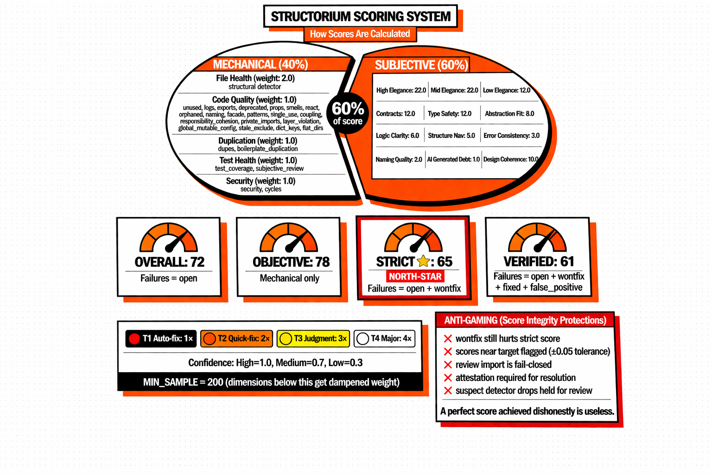
</p>

### The 4 Score Types

Structorium doesn't give you one number and call it a day. It computes **four progressively stricter score types**, each designed to catch a different kind of dishonesty. They all look at the same findings — the difference is what counts as a "failure" in each mode:

| Score | Counts as Failure | North Star? | Why It Exists |
|:------|:-----------------|:-----------:|:---------|
| **Overall** | `open` only | | The broadest, most forgiving view. Good for dashboards and high-level trending. But easy to game — just dismiss everything as `wontfix`. |
| **Objective** | `open` (mechanical dimensions only) | | The mechanical-only lens. How clean is the code ignoring subjective assessment? Useful for comparing tooling quality, but misses 60% of what matters. |
| **Strict** ⭐ | `open` + `wontfix` | ⭐ **Yes** | **The metric that matters.** The only way to improve this score is to actually fix things or get better review scores. Mass `wontfix` dismissals — which inflate overall score — still hurt strict. This is the metric you track day-to-day, sprint-to-sprint, quarter-to-quarter. |
| **Verified Strict** | `open` + `wontfix` + `fixed` + `false_positive` | | The maximum-paranoia metric. Even `fixed` and `false_positive` count as failures — only genuinely absent issues pass. Useful for audits and highest-confidence reporting. Too strict for daily tracking, but invaluable when you need absolute trust. |

### Why Strict Is the North Star

Let's be blunt about why the other scores are insufficient:

- **Overall** can be trivially gamed by marking everything `wontfix`. Your score jumps from 45 to 85 overnight. Your code is exactly as terrible as it was yesterday. The number is a lie.
- **Objective** ignores subjective quality entirely — which means it ignores 60% of what matters. A codebase that passes every lint rule but has incoherent architecture, brittle abstractions, and AI-generated spaghetti gets a high objective score. Useless.
- **Strict** combines both halves AND penalizes `wontfix`. The only way to improve it: actually fix things, get better review scores, or prevent new regressions. There's no shortcut. There's no cheat code. That's why it's the north star.
- **Verified strict** goes even further (penalizes `fixed` and `false_positive` too) — useful as an audit metric, but too strict for daily tracking because it requires zero uncertainty.

---

## 📐 Score Composition Formula

### Top-Level Split

```
Overall Score = 40% × Mechanical Pool + 60% × Subjective Pool
```

This is defined in [`engine/_scoring/policy/core.py`](engine/_scoring/policy/core.py):
- `MECHANICAL_WEIGHT_FRACTION = 0.40`
- `SUBJECTIVE_WEIGHT_FRACTION = 0.60`

### Mechanical Pool (40%)

The mechanical pool is computed from **5 dimensions**, each with a weight:

| Dimension | Weight | Detectors Assigned |
|:----------|:------:|:------------------|
| **File health** | 2.0 | `structural` |
| **Code quality** | 1.0 | `unused`, `logs`, `exports`, `deprecated`, `props`, `smells`, `react`, `orphaned`, `naming`, `facade`, `patterns`, `single_use`, `coupling`, `dict_keys`, `flat_dirs`, `global_mutable_config`, `private_imports`, `layer_violation`, `stale_exclude`, `responsibility_cohesion`, `uncalled_functions`, `signature` |
| **Duplication** | 1.0 | `dupes`, `boilerplate_duplication` |
| **Test health** | 1.0 | `test_coverage`, `subjective_review` |
| **Security** | 1.0 | `security`, `cycles` |

**Why File Health gets 2× weight**: Structural issues (god files, massive modules) are force-multipliers — they make every other problem worse. A 1000-line file with 3 issues is harder to fix than three 100-line files with 1 issue each.

### Subjective Pool (60%)

The subjective pool is computed from **12 dimensions** (see [Subjective Dimensions Reference](#-subjective-dimensions-reference) for full details), with weights from `SUBJECTIVE_DIMENSION_WEIGHTS`:

```
high elegance:     22.0    |    logic clarity:        6.0
mid elegance:      22.0    |    structure nav:         5.0
low elegance:      12.0    |    error consistency:     3.0
contracts:         12.0    |    naming quality:        2.0
type safety:       12.0    |    ai generated debt:     1.0
abstraction fit:    8.0    |    design coherence:     10.0
```

### Tier Weighting

Within each dimension, findings are weighted by their tier:

| Tier | Action Type | Weight | Meaning |
|:-----|:-----------|:------:|:--------|
| T1 | `auto_fix` | 1× | Can be fixed automatically — lowest impact per finding |
| T2 | `quick_fix` | 2× | Quick manual fix — moderate impact |
| T3 | `judgment` | 3× | Requires design judgment — significant impact |
| T4 | `major_refactor` | 4× | Major refactoring needed — highest impact per finding |

### Confidence Weighting

Finding confidence affects how much weight it gets in the score:

| Confidence | Weight | When |
|:-----------|:------:|:-----|
| High | 1.0 | Full external tool support, deterministic detection |
| Medium | 0.7 | Heuristic detection or partial tool support |
| Low | 0.3 | Speculative or environment-dependent |

### MIN_SAMPLE Dampening

If a dimension has fewer than `MIN_SAMPLE = 200` checks, its weight is **proportionally reduced**:

```
effective_weight = base_weight × min(actual_checks / MIN_SAMPLE, 1.0)
```

This prevents small-sample dimensions from swinging the overall score. A project with only 5 files shouldn't have its structural score dominate — the sample is too small for confidence.

> **Source**: [`engine/_scoring/policy/core.py`](engine/_scoring/policy/core.py) (lines 127-159)

---

## 🛡️ Anti-Gaming Deep Dive

### Score Gaming Detection

Structorium actively watches for gaming patterns:

| Pattern | How It's Detected | What Happens |
|:--------|:-----------------|:-------------|
| **Mass wontfix** | `wontfix` count increases while `fixed` stays flat | Strict score drops. Gap between overall and strict widens — visible in `status`. |
| **Target matching** | Subjective score lands within ±0.05 of a round target (e.g., 80.00) | Flagged as potential gaming. `SUBJECTIVE_TARGET_MATCH_TOLERANCE = 0.05` |
| **Sudden detector drops** | A detector goes from 40 findings to 0 | Findings held in state (not auto-resolved). Warning emitted. |
| **Partial review import** | Some findings in review are invalid or skipped | Entire import aborted. No partial results accepted. |

### Failure Statuses by Score Mode

The exact definitions from source code ([`engine/_scoring/policy/core.py`](engine/_scoring/policy/core.py) line 183):

```python
FAILURE_STATUSES_BY_MODE = {
    "lenient":         frozenset({"open"}),
    "strict":          frozenset({"open", "wontfix"}),
    "verified_strict": frozenset({"open", "wontfix", "fixed", "false_positive"}),
}
```

### The Suppression Gap

A useful diagnostic: compare your **overall score** (lenient mode) to your **strict score**:

| Gap | What It Means |
|:----|:-------------|
| Overall ≈ Strict (< 2 points) | Healthy — very few wontfix dismissals |
| Overall > Strict by 5-10 | Some debt is being dismissed — review wontfix decisions |
| Overall > Strict by 15+ | Significant gaming — many issues marked wontfix instead of fixed |

This gap is visible in `structorium status` and tracked across sessions.

> **Source**: [`engine/_scoring/policy/core.py`](engine/_scoring/policy/core.py), [`intelligence/integrity.py`](intelligence/integrity.py)

---

<!-- ============================================================ -->
<!-- PART 8: PLUGIN ARCHITECTURE                                   -->
<!-- ============================================================ -->

# PART 8 — PLUGIN ARCHITECTURE

---

## 🔌 Plugin Architecture

<p align="center">
  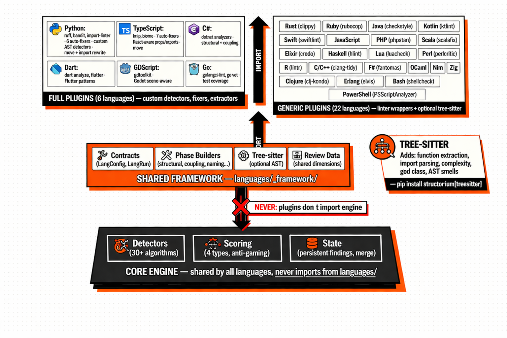
</p>

Structorium supports **28 programming languages** through a layered plugin architecture so clean that adding a new language **can never break an existing one**. This is not an accident — it's a hard architectural rule enforced by import direction constraints.

### Architecture Layers

| Layer | What It Contains | Key Rule |
|:------|:----------------|:---------|
| **Core Engine** (bottom) | Detectors, scoring, state management, work queue | Shared by all languages. **Never imports from `languages/`**. |
| **Shared Framework** (middle) | `languages/_framework/`: contracts, phase builders, tree-sitter integration, review data | Common infrastructure for all plugins. Handles generic analysis. |
| **Language Plugins** (top) | `languages/<name>/`: 6 full plugins + 22 generic plugins | Import from framework and engine. **Plugins never import each other.** |

### Import Direction Rule

```
✅ Plugin → Framework → Engine (allowed)
❌ Engine → Plugin (NEVER)
❌ Plugin → Plugin (NEVER)
```

This strict import direction ensures:
- Adding a new language can never break existing ones
- The engine is language-agnostic — it works with any plugin
- Plugins are isolated — a Python bug can't crash the TypeScript scanner

---

## 📦 Full Plugin Contract

A **full plugin** (6 languages) provides deep, language-aware integration. The required package structure:

```
languages/<name>/
├── __init__.py          # @register_lang() — config, markers, extensions
├── commands.py          # Language-specific CLI commands
├── extractors.py        # Source code extractors (functions, imports, classes)
├── phases.py            # Detector phase definitions
├── move.py              # File relocation + import path rewriting
├── review.py            # Subjective review dimension definitions
├── test_coverage.py     # Test-to-source mapping logic
├── detectors/           # Custom language-specific detectors
├── fixers/              # Auto-fixer implementations
└── tests/               # Language-specific test suite
```

### What Full Plugins Get (Beyond Generic)

| Capability | Generic | Full |
|:-----------|:--------|:-----|
| External linter wrapping | ✅ | ✅ |
| Security scanning | ✅ | ✅ |
| Subjective review | ✅ | ✅ (custom dimensions) |
| Boilerplate detection | ✅ | ✅ |
| Zone classification | ✅ | ✅ |
| Scoring integration | ✅ | ✅ |
| Tree-sitter AST (if installed) | ✅ | ✅ |
| **Custom smell detectors** | ❌ | ✅ |
| **Language-aware auto-fixers** | ❌ | ✅ |
| **Custom review dimensions** | ❌ | ✅ |
| **Framework-specific patterns** | ❌ | ✅ (e.g., React for TS, Flutter for Dart) |
| **Move + import rewriting** | ❌ | ✅ |

---

## 🔧 Generic Plugin System

A **generic plugin** (22 languages) provides solid coverage with minimal code. Most generic plugins are a single `__init__.py` file calling the `generic_lang()` factory:

```python
# languages/rust/__init__.py (simplified example)
from languages._framework.generic import generic_lang

config = generic_lang(
    name="rust",
    extensions=[".rs"],
    root_markers=["Cargo.toml"],
    tools=[
        {"name": "cargo clippy", "cmd": ["cargo", "clippy", "--message-format=json"]},
        {"name": "cargo check",  "cmd": ["cargo", "check",  "--message-format=json"]},
    ],
    treesitter_lang="rust",
)
```

### What Tree-sitter Adds to Generic Plugins

When `pip install structorium[treesitter]` is installed, generic plugins gain AST-powered analysis:

| Capability | Without Tree-sitter | With Tree-sitter |
|:-----------|:-------------------|:----------------|
| Function extraction | ❌ | ✅ Names, ranges, complexity scores |
| Import parsing | ❌ | ✅ Import statements with source resolution |
| Complexity metrics | ❌ | ✅ Cyclomatic complexity per function |
| God class detection | ❌ | ✅ Large classes with many methods |
| Unused import detection | ❌ | ✅ Cross-reference imports vs usage |
| AST smell detection | ❌ | ✅ Language-generic code smells |
| Cohesion analysis | ❌ | ✅ Module cohesion metrics |

### Upgrade Path

Generic plugins can be upgraded incrementally:
1. **Generic** → Basic linter wrapping + optional tree-sitter
2. **Extended-in-place** → Add custom detectors or fixers to the generic plugin
3. **Full plugin** → Scaffold with `structorium dev scaffold-lang <name>` and implement the full contract

---

## 🧩 Shared Framework Deep Dive

The `languages/_framework/` directory provides the shared infrastructure that powers all plugins:

```
languages/_framework/
├── generic.py           # generic_lang() factory for single-file plugins
├── base/                # Core contracts and shared phase builders
│   ├── contracts.py     # LangConfig, LangRun protocol definitions
│   ├── phase_builders.py # Shared detector phase implementations
│   ├── structural.py    # Structural analysis (file size, complexity)
│   └── shared_phases.py # Phases available to all plugins
├── treesitter/          # Optional tree-sitter integration
│   ├── specs.py         # Language spec definitions
│   ├── extractors.py    # AST-based code extraction
│   ├── imports.py       # Import statement parsing
│   ├── complexity.py    # Cyclomatic complexity computation
│   ├── smells.py        # AST-based smell detection
│   ├── cohesion.py      # Module cohesion analysis
│   └── unused_imports.py # Cross-reference import usage
├── runtime.py           # LangRun per-invocation mutable state
├── resolution.py        # Language detection and resolution
├── discovery.py         # Plugin auto-discovery via importlib
├── commands_base.py     # Shared detect-command factories
└── review_data/         # Shared review dimension JSON payloads
```

### Key Contracts

- **`LangConfig`**: Static configuration for a language plugin — extensions, markers, tools, capabilities. Set once at registration. Never mutated.
- **`LangRun`**: Per-invocation mutable state — file lists, findings, scores. Created fresh for each scan. Discarded after.
- **Phase protocol**: Each detector phase is a function `(LangRun) → list[Finding]`. Phases can be composed, filtered, and ordered.

---

## 🌍 Language Coverage Atlas

<p align="center">
  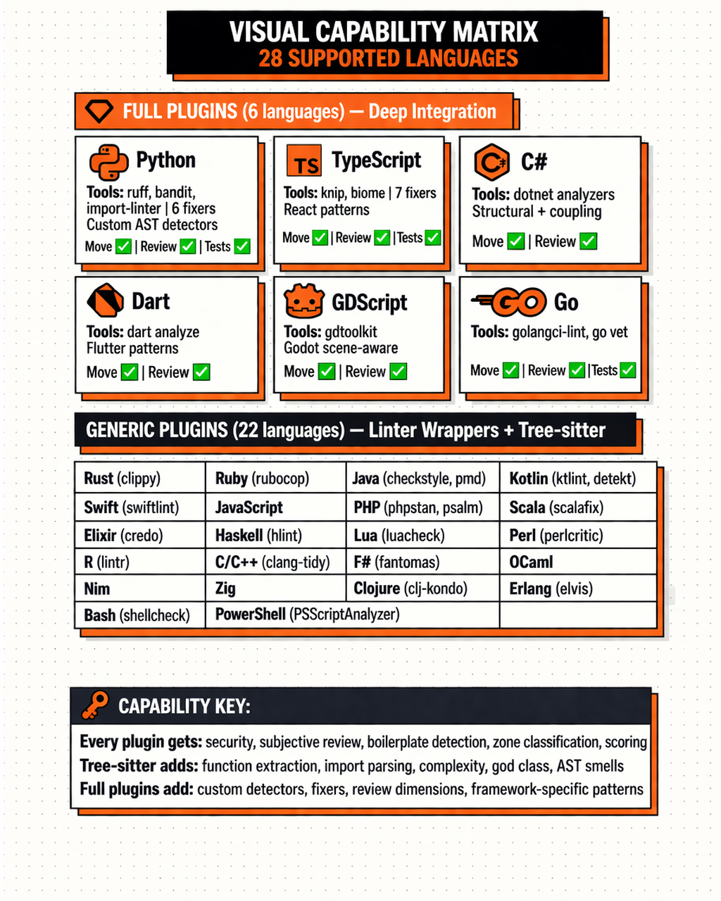
</p>

### Full Plugins (6 Languages — Deep Integration)

| Language | External Tools | Custom Detectors | Auto-Fixers | Move/Rewrite | Review Dimensions |
|:---------|:--------------|:----------------|:-----------|:------------|:-----------------|
| 🐍 **Python** | ruff, bandit, import-linter | AST smells, dict keys, security patterns | `unused-imports`, `unused-vars`, `unused-params`, `debug-logs` | ✅ Import rewriting | ✅ Custom |
| 📘 **TypeScript** | knip, biome | React patterns, props, exports, concerns | `unused-imports`, `unused-vars`, `unused-params`, `debug-logs`, `dead-useeffect`, `empty-if-chain` | ✅ Import rewriting | ✅ Custom |
| 🔷 **C# / .NET** | dotnet analyzers | Structural, coupling | — | ✅ Using directives | ✅ Custom |
| 🎯 **Dart** | dart analyze, flutter test | Flutter patterns | — | ✅ Package imports | ✅ Custom |
| 🎮 **GDScript** | gdtoolkit | Godot scene-aware | — | ✅ Preload/load | ✅ Custom |
| 🐹 **Go** | golangci-lint, go vet | — | — | ✅ Package imports | ✅ Custom |

### Generic Plugins (22 Languages — Linter Wrappers + Tree-sitter)

| Language | External Tools | Tree-sitter |
|:---------|:--------------|:----------:|
| 🦀 Rust | cargo clippy, cargo check | ✅ |
| 💎 Ruby | rubocop | ✅ |
| ☕ Java | checkstyle, pmd | ✅ |
| 🟣 Kotlin | ktlint, detekt | ✅ |
| 🍎 Swift | swiftlint | ✅ |
| 🟨 JavaScript | *(via TypeScript plugin)* | ✅ |
| 🐘 PHP | phpstan, psalm | ✅ |
| 🔴 Scala | scalafmt, scalafix | ✅ |
| 💧 Elixir | credo | ✅ |
| λ Haskell | hlint | ✅ |
| 🌙 Lua | luacheck | ✅ |
| 🐪 Perl | perlcritic | ✅ |
| 📊 R | lintr | ✅ |
| ⚡ C/C++ | clang-tidy, cppcheck | ✅ |
| 🔷 F# | fantomas | ✅ |
| 🐫 OCaml | — | ✅ |
| 👑 Nim | — | ✅ |
| ⚡ Zig | — | ✅ |
| 🟢 Clojure | clj-kondo | ✅ |
| 📡 Erlang | elvis | ✅ |
| 🐚 Bash | shellcheck | ✅ |
| 💠 PowerShell | PSScriptAnalyzer | ✅ |

### What Every Plugin Gets (Full or Generic)

Regardless of plugin tier, every language gets:
- ✅ Security scanning
- ✅ Subjective AI review (12 dimensions)
- ✅ Boilerplate duplication detection
- ✅ Zone classification
- ✅ Scoring integration (4 score types)
- ✅ Priority queue ranking
- ✅ State persistence

### Adding a New Language

```bash
# Scaffold a new full plugin
structorium dev scaffold-lang <name> --extension .ext --marker <root-file>

# Or create a minimal generic plugin
# Create: languages/<name>/__init__.py
# Use the generic_lang() factory (see Generic Plugin System above)
```

> **Source**: [`languages/_framework/`](languages/_framework/), [`languages/__init__.py`](languages/__init__.py), [`languages/README.md`](languages/README.md)

---

<!-- ============================================================ -->
<!-- PART 9: COMPETITIVE POSITIONING                               -->
<!-- ============================================================ -->

# PART 9 — COMPETITIVE POSITIONING

---

## 🏆 Structorium vs Traditional Linters

| Capability | Structorium | ESLint / Ruff / RuboCop |
|:-----------|:-----------|:-----------------------|
| **Purpose** | Codebase quality operating system | Rule-based code linting |
| **State** | Persistent — findings survive across sessions | Stateless — each run starts fresh |
| **Multi-language** | 28 languages via plugin system | 1 language per tool |
| **Ranking** | Tier-weighted priority queue | Flat list (all warnings equal) |
| **Review** | 12-dimension AI subjective review (60% of score) | None — rules only |
| **Scoring** | 4 score types with anti-gaming | Pass/fail on rule count |
| **CI gate** | New-code gate (line-scoped, policy profiles) | Block on any violation |
| **Architecture** | Detects coupling, god files, layer violations, cycles | Syntax/style rules only |
| **Fix tracking** | Resolution status (fixed/wontfix/false_positive) with attestation | Not applicable |
| **Agent support** | Skill system for 7 AI agents | No agent integration |

> **Summary**: Linters are **components** of Structorium — it wraps ruff, bandit, knip, rubocop, etc. and adds state, ranking, scoring, and enforcement on top.

---

## 🏢 Structorium vs Enterprise SAST

| Capability | Structorium | SonarQube | GitHub CodeQL |
|:-----------|:-----------|:---------|:-------------|
| **Deployment** | CLI — zero infrastructure | Server (requires DB, Compute, ElasticSearch) | GitHub-hosted or self-hosted runner |
| **Cost** | Open source (MIT) | Community (free) / Enterprise ($$$) | Free for public repos / Advanced Security (paid) |
| **Architecture quality** | Coupling, god files, layer violations, cycles, facades, design coherence | Basic duplications, complexity | Security-focused queries |
| **Subjective review** | ✅ 12 dimensions, 60% of score | ❌ | ❌ |
| **Anti-gaming** | ✅ wontfix penalty, target detection, fail-closed import, suspect drops | ⚡ Basic (quality gate thresholds) | ❌ |
| **Persistent state** | ✅ File-based, no server needed | ✅ Server-based database | ❌ No state between runs |
| **Ranked queue** | ✅ Tier-weighted, confidence-adjusted | ❌ Issues sorted by severity | ❌ |
| **Agent-first** | ✅ Skill system, CLI-native | ❌ Web UI focused | ❌ |
| **Language count** | 28 (6 full + 22 generic) | 30+ | ~15 |
| **New-code gate** | ✅ Line-scoped with policy profiles | ✅ Quality Gate (metric-based) | ✅ PR check annotations |
| **Move/rewrite** | ✅ File relocation + import rewriting | ❌ | ❌ |
| **Setup time** | `pip install structorium` (30 seconds) | 30-60 minutes (server setup) | 10-30 minutes (workflow config) |

> **Summary**: SonarQube is a **server** — good for enterprises with ops capacity. CodeQL is **security-focused**. Structorium is a **CLI-native operating system** designed for solo developers, small teams, and AI agents.

---

## 🤖 Structorium vs AI Code Review Tools

| Capability | Structorium | DeepSource | Snyk Code | CodeRabbit |
|:-----------|:-----------|:----------|:---------|:-----------|
| **Architecture** | CLI (zero infra) | Cloud-hosted | Cloud-hosted | GitHub App |
| **State** | ✅ Persistent file-based | ✅ Cloud database | ❌ | ❌ |
| **Subjective review** | ✅ 12 structured dimensions | ❌ Rule-based | ❌ Rule-based | ✅ Unstructured LLM review |
| **Anti-gaming** | ✅ 5 mechanisms | ❌ | ❌ | ❌ |
| **Ranked queue** | ✅ | ❌ | ❌ | ❌ |
| **Structured scoring** | ✅ 4 types, formula-driven | ⚡ Basic metrics | ❌ | ❌ |
| **Review memory** | ✅ Incremental, session-aware | ❌ | ❌ | ❌ |
| **Fail-closed import** | ✅ Invalid reviews rejected entirely | N/A | N/A | N/A |
| **Privacy** | ✅ Local-first (AI context is opt-in) | ❌ Cloud analysis | ❌ Cloud analysis | ❌ Cloud analysis |
| **Agent skill system** | ✅ 7 agents supported | ❌ | ❌ | ❌ |

> **Summary**: DeepSource and Snyk are **cloud analyzers** — they see your code. CodeRabbit does **unstructured** LLM review. Structorium does **structured, dimension-scoped, fail-closed** review with full state persistence and anti-gaming. And it runs locally.

---

## 🧹 Structorium vs AI Slop Catchers

| Capability | Structorium | Grain | Sloppylint | QodoAI |
|:-----------|:-----------|:-----|:----------|:-------|
| **Scope** | Full codebase quality OS | AI-generated code detection | AI slop detection | AI code review |
| **Detectors** | 30+ (mechanical + subjective) | Focused on AI patterns | Focused on AI patterns | LLM-based review |
| **State persistence** | ✅ | ❌ | ❌ | ❌ |
| **Multi-language** | 28 | Limited | Limited | Limited |
| **Scoring** | 4 types with anti-gaming | Basic | Basic | LLM-based |
| **AI debt detection** | ✅ "ai generated debt" dimension (weight 1.0) | ✅ Primary focus | ✅ Primary focus | ⚡ |
| **CI enforcement** | ✅ New-code gate | ⚡ | ⚡ | ⚡ |
| **Non-AI quality** | ✅ Full architecture analysis | ❌ AI-only | ❌ AI-only | ⚡ |

> **Summary**: Slop catchers handle **one problem** (detecting AI-generated code). Structorium handles **all quality problems** — including AI debt as one of 12 subjective dimensions.

---

## 🧠 AI Model Comparison Matrix

Structorium's review system works with multiple AI providers. Here's how different models perform in subjective review:

| Dimension | GPT-4o | Claude 3.5 Sonnet | Codex | Gemini 2.5 Pro |
|:----------|:-------|:------------------|:------|:---------------|
| High elegance | ⭐⭐⭐⭐ | ⭐⭐⭐⭐⭐ | ⭐⭐⭐ | ⭐⭐⭐⭐ |
| Contracts | ⭐⭐⭐⭐ | ⭐⭐⭐⭐ | ⭐⭐⭐ | ⭐⭐⭐⭐ |
| Type safety | ⭐⭐⭐⭐⭐ | ⭐⭐⭐⭐ | ⭐⭐⭐ | ⭐⭐⭐⭐ |
| Design coherence | ⭐⭐⭐ | ⭐⭐⭐⭐⭐ | ⭐⭐⭐ | ⭐⭐⭐⭐ |
| AI debt detection | ⭐⭐⭐ | ⭐⭐⭐⭐ | ⭐⭐⭐⭐⭐ | ⭐⭐⭐⭐ |

> **Note**: Model quality varies by codebase. Structorium's fail-closed import validation catches low-quality reviews regardless of model. Use `--parallel` with batch splitting to reduce variance.

---

<!-- ============================================================ -->
<!-- PART 10: INTERNALS & REFERENCE                                -->
<!-- ============================================================ -->

# PART 10 — INTERNALS & REFERENCE

---

## 📖 Detector Registry — Complete Reference

Every detector in Structorium is registered in [`core/registry.py`](core/registry.py). This is the canonical source:

### Auto-Fix Detectors (T1)

| Detector | Display | Dimension | Fixers | Guidance |
|:---------|:--------|:----------|:-------|:---------|
| `unused` | unused | Code quality | `unused-imports`, `unused-vars`, `unused-params` | Remove unused imports and variables |
| `logs` | logs | Code quality | `debug-logs` | Remove debug logs |
| `smells` | smells | Code quality | `dead-useeffect`, `empty-if-chain` | Fix code smells |

### Reorganize Detectors (T2 — use `move`)

| Detector | Display | Dimension | Tool | Guidance |
|:---------|:--------|:----------|:-----|:---------|
| `orphaned` | orphaned | Code quality | `move` | Delete dead files or relocate |
| `flat_dirs` | flat dirs | Code quality | `move` | Create subdirectories |
| `naming` | naming | Code quality | `move` | Rename files to fix conventions |
| `single_use` | single_use | Code quality | `move` | Inline or relocate |
| `coupling` | coupling | Code quality | `move` | Fix boundary violations |
| `cycles` | cycles | Security | `move` | Break circular dependencies |
| `facade` | facade | Code quality | `move` | Flatten re-export facades |

### Refactor Detectors (T3)

| Detector | Display | Dimension | Judgment? | Guidance |
|:---------|:--------|:----------|:---------|:---------|
| `structural` | structural | File health | ✅ | Decompose large files |
| `props` | props | Code quality | ✅ | Split bloated components |
| `react` | react | Code quality | ✅ | Refactor React antipatterns |
| `dupes` | dupes | Duplication | ✅ | Extract shared utility |
| `patterns` | patterns | Code quality | ✅ | Align to single pattern |
| `dict_keys` | dict keys | Code quality | ✅ | Fix dict key mismatches |
| `test_coverage` | test coverage | Test health | | Add tests for untested modules |
| `signature` | signature | Code quality | ✅ | Consolidate inconsistent signatures |
| `responsibility_cohesion` | responsibility cohesion | Code quality | ✅ | Split modules with too many responsibilities |
| `boilerplate_duplication` | boilerplate duplication | Duplication | ✅ | Extract shared boilerplate |
| `uncalled_functions` | uncalled functions | Code quality | ✅ | Remove dead functions |
| `concerns` | design concerns | Design coherence | | Address design concerns from review |

### Manual Fix Detectors (T4)

| Detector | Display | Dimension | Guidance |
|:---------|:--------|:----------|:---------|
| `exports` | exports | Code quality | Run `knip --fix` to remove dead exports |
| `deprecated` | deprecated | Code quality | Remove deprecated symbols or migrate callers |
| `stale_exclude` | stale exclude | Code quality | Remove stale exclusion or verify it's still needed |
| `global_mutable_config` | global mutable config | Code quality | Refactor module-level mutable state |
| `private_imports` | private imports | Code quality | Stop importing private symbols across boundaries |
| `layer_violation` | layer violation | Code quality | Fix architectural layer violations |
| `security` | security | Security | Review and fix security findings |
| `stale_wontfix` | stale wontfix | Code quality | Re-evaluate old wontfix decisions |

### Review Detectors

| Detector | Display | Dimension | Guidance |
|:---------|:--------|:----------|:---------|
| `review` | design review | Test health | Address design quality findings from AI review |
| `subjective_review` | subjective review | Test health | Run `structorium review --prepare` |

> **Source**: [`core/registry.py`](core/registry.py) (lines 59-321)

---

## 🗺️ Command Atlas

Structorium provides **17 commands** organized by workflow mode:

### Workflow Commands (Day-to-Day)

| Command | What It Does | Key Flags |
|:--------|:------------|:---------|
| `structorium scan` | Run all detectors, merge findings, compute scores | `--path`, `--profile`, `--lang`, `--skip-slow` |
| `structorium status` | Score dashboard, dimension health, finding summary | `--gate-check`, `--json` |
| `structorium next` | Surface highest-priority finding | `--count`, `--tier`, `--cluster`, `--explain` |
| `structorium fix` | Run auto-fixers | `<fixer-name>`, `--dry` |

### Investigation Commands

| Command | What It Does | Key Flags |
|:--------|:------------|:---------|
| `structorium show` | Show findings for a specific file | `<filepath>` |
| `structorium tree` | Annotated codebase tree with finding counts | `--depth`, `--zone` |
| `structorium diff` | Show score/finding changes between states | `--before`, `--after` |
| `structorium langs` | List all detected language plugins | — |

### Review Commands

| Command | What It Does | Key Flags |
|:--------|:------------|:---------|
| `structorium review --prepare` | Generate review query packet | `--retrospective`, `--files` |
| `structorium review --run-batches` | Execute review with AI runner | `--runner`, `--parallel` |
| `structorium review --import` | Import review results (fail-closed) | `<filepath>` |
| `structorium review --external-start` | Start external review session | `--external-runner` |

### Enforcement Commands

| Command | What It Does | Key Flags |
|:--------|:------------|:---------|
| `structorium plan` | Full prioritized work queue | `queue`, `done`, `move`, `defer`, `skip`, `reopen` |
| `structorium plan cluster` | Cluster operations | `create`, `delete`, `list` |
| `structorium plan focus/unfocus` | Scope `next` to a cluster | `<cluster-name>` |

### Admin Commands

| Command | What It Does | Key Flags |
|:--------|:------------|:---------|
| `structorium config` | View/set configuration | `set`, `get`, `list` |
| `structorium update-skill` | Install/update agent skill document | `<agent-name>` |
| `structorium move` | Relocate file + rewrite imports | `<source>`, `<destination>` |
| `structorium zone` | Manage zone classifications | `show`, `set`, `clear` |
| `structorium scorecard` | Generate quality badge image | `--output` |

> **Source**: [`app/cli_support/parser.py`](app/cli_support/parser.py)

---

## 🗂️ Repository Structure

```
structorium/
├── app/                           # Application layer — CLI entry point
│   ├── cli_support/               # Parser, output formatting, terminal
│   │   ├── parser.py              # Argument parser (17 commands)
│   │   └── output.py              # Terminal output formatting
│   ├── commands/                   # Command implementations
│   │   ├── scan/                   # Scan workflow and reporting
│   │   ├── plan/                   # Plan operations (queue, clusters)
│   │   ├── review/                 # Review preparation, batching, import
│   │   └── ...                     # next, show, tree, fix, move, etc.
│   └── main.py                    # CLI entry point
├── core/                           # Shared core — enums, registry, types
│   ├── registry.py                 # Canonical detector registry (30+ detectors)
│   ├── enums.py                    # Tier, Confidence, ScoreMode enums
│   └── types.py                    # Shared type definitions
├── engine/                         # Engine — scoring, state, detection
│   ├── _scoring/                   # Score computation
│   │   ├── policy/                 # Scoring policies, weights, dimensions
│   │   │   └── core.py             # THE canonical scoring config
│   │   └── compute.py              # Score calculation logic
│   ├── _work_queue/                # Priority queue and ranking
│   ├── planning/                   # Plan operations and cluster management
│   ├── policy/                     # Zone policies
│   └── detection/                  # Detector execution and orchestration
├── intelligence/                   # AI layer — context, gate, integrity
│   ├── ai/                         # AI context enrichment providers
│   ├── new_code_gate.py            # CI new-code gate evaluation
│   └── integrity.py                # Anti-gaming integrity checks
├── languages/                      # Language plugins (28 languages)
│   ├── _framework/                 # Shared framework
│   │   ├── base/                   # Core contracts and phase builders
│   │   ├── treesitter/             # Optional tree-sitter integration
│   │   └── generic.py              # generic_lang() factory
│   ├── python/                     # Full plugin — ruff, bandit, 6 fixers
│   ├── typescript/                 # Full plugin — knip, biome, 7 fixers
│   ├── csharp/                     # Full plugin — dotnet analyzers
│   ├── dart/                       # Full plugin — dart analyze, flutter
│   ├── gdscript/                   # Full plugin — gdtoolkit
│   ├── go/                         # Full plugin — golangci-lint
│   ├── rust/                       # Generic plugin — cargo clippy
│   ├── ruby/                       # Generic plugin — rubocop
│   ├── java/                       # Generic plugin — checkstyle, pmd
│   └── ...                         # +19 more generic plugins
├── skills/                         # Agent skill documents (7 agents)
├── .structorium/                   # State directory (created on first scan)
│   ├── state.json                  # Persistent findings and scores
│   ├── reviews/                    # Review packets and results
│   └── config.toml                 # Project configuration
└── docs/                           # Documentation
```

---

## ⚙️ Configuration Reference

Configuration is stored in `.structorium/config.toml` and managed via `structorium config`:

| Key | Default | What It Controls |
|:----|:--------|:----------------|
| `new_code_gate_enabled` | `false` | Enable/disable CI gate |
| `new_code_gate_policy` | `standard` | Policy profile (strict/standard/ai_generated_code) |
| `new_code_gate_base_ref` | `origin/main` | Git base ref for diff |
| `new_code_gate_max_new_findings` | *(policy default)* | Max new findings before gate fails |
| `new_code_gate_max_new_high` | `0` | Max T3+ findings |
| `new_code_gate_max_new_critical` | `0` | Max T4 findings |
| `ai_embedding_model` | `text-embedding-3-large` | OpenAI embedding model |
| `ai_reranker_model` | `rerank-v4.0` | Cohere reranker model |
| `exclude_patterns` | `[]` | Path exclusion patterns |

---

## 💾 State Schema Deep Dive

The `.structorium/state.json` file is the persistent state file. Key fields:

```jsonc
{
  "version": "1.0",
  "last_scan": "2025-03-25T12:00:00Z",
  "scores": {
    "overall": 72.3,
    "objective": 78.1,
    "strict": 64.8,
    "verified_strict": 61.2
  },
  "dimension_scores": {
    "file_health": { "score": 82.0, "checks": 450, "failures": 81 },
    "code_quality": { "score": 54.0, "checks": 1200, "failures": 552 },
    // ... all 17 dimensions
  },
  "findings": [
    {
      "id": "unused::src/api/routes.ts::React",
      "detector": "unused",
      "file": "src/api/routes.ts",
      "line": 1,
      "detail": "unused import: React",
      "tier": 1,
      "confidence": "high",
      "status": "open",           // open | fixed | wontfix | false_positive
      "first_seen": "2025-03-20T10:00:00Z",
      "last_seen": "2025-03-25T12:00:00Z",
      "note": null,
      "attestation": null
    }
    // ... all findings
  ]
}
```

### State Merge Semantics

On each scan, state merging follows these rules:
1. **New findings** (not in state) → added with status `open`
2. **Existing findings** (still detected) → `last_seen` updated, status preserved
3. **Gone findings** (not detected, status = `open`) → resolved automatically
4. **Resolved findings** (status ≠ `open`) → preserved regardless of scan results
5. **Suspect drops** (detector went from many findings to 0) → held, not auto-resolved

---

<!-- ============================================================ -->
<!-- PART 11: FORMULA APPENDIX                                     -->
<!-- ============================================================ -->

# PART 11 — FORMULA APPENDIX

---

## 📊 Score Composition Formulas

### Dimension Pass Rate

For each dimension, the pass rate is computed as:

```
pass_rate = 1 - (weighted_failures / potential)

weighted_failures = Σ (tier_weight × confidence_weight) for each failing finding
potential = total_checks in that dimension
```

For **file-based detectors** (`smells`, `dict_keys`, `test_coverage`, `security`, `subjective_review`):
```
weighted_failure_per_file = min(sum_of_findings_in_file, 1.0)
# Capped at 1.0 per file to match file-based denominator
```

### Pool Score

```
mechanical_pool = Σ (dimension_pass_rate × effective_weight) / Σ effective_weight
    where effective_weight = base_weight × min(checks / MIN_SAMPLE, 1.0)
    for each mechanical dimension

subjective_pool = Σ (dimension_score × weight) / Σ weight
    for each subjective dimension
```

### Overall Score

```
overall = (MECHANICAL_WEIGHT_FRACTION × mechanical_pool
         + SUBJECTIVE_WEIGHT_FRACTION × subjective_pool) × 100
```

### Score Mode Selection

```python
# What counts as "failure" depends on the mode:
lenient:         {"open"}
strict:          {"open", "wontfix"}
verified_strict: {"open", "wontfix", "fixed", "false_positive"}
```

---

## 📈 Detection Pass Rate

### LOC-Weighted Detectors

For `test_coverage`, findings are weighted by source lines of code:

```
loc_weight = file_loc / total_project_loc
weighted_failure = loc_weight × finding_weight
```

This ensures that a missing test for a 500-line module hurts the score more than a missing test for a 20-line module.

### Zone Exclusions

Security findings in excluded zones (`test`, `config`, `generated`, `vendor`) are **not counted** in the score:

```python
SECURITY_EXCLUDED_ZONES = frozenset({"test", "config", "generated", "vendor"})
```

---

## 🚦 New-Code Gate Threshold Logic

```python
# Pseudocode from intelligence/new_code_gate.py
def evaluate_gate(findings, changed_ranges, policy):
    in_scope = [f for f in findings if f.file in changed_ranges
                and f.line in changed_ranges[f.file]]
    
    new_count = len(in_scope)
    new_high = len([f for f in in_scope if f.tier >= 3])
    new_critical = len([f for f in in_scope if f.tier >= 4])
    
    blocked_hits = [f for f in in_scope
                    if f.detector in policy.blocked_detectors]
    
    if new_count > policy.max_new_findings: return FAIL
    if new_high > policy.max_new_high: return FAIL
    if new_critical > policy.max_new_critical: return FAIL
    if blocked_hits: return FAIL
    
    return PASS
```

---

## 🔗 Temporal Coupling

Temporal coupling is computed from git history:

```
coupling_score(file_a, file_b) = co_change_count / max(change_count_a, change_count_b)
```

- A score of 0.8 means "these two files change together 80% of the time"
- High temporal coupling suggests latent architectural coupling
- Used to enrich review context: "This file has 82% temporal coupling with state.py"

---

<!-- ============================================================ -->
<!-- PART 12: OPERATIONAL GUIDES & CLOSURE                         -->
<!-- ============================================================ -->

# PART 12 — OPERATIONAL GUIDES & CLOSURE

---

## 🎯 Real Operator Scenarios

### Scenario 1: Solo Developer Starting Cleanup

```bash
# Day 1: Baseline
pip install structorium
structorium scan --path .
structorium status              # See where you stand

# Day 1: Quick wins (auto-fix)
structorium fix unused-imports
structorium fix debug-logs
structorium scan --path .       # Score should improve
structorium status              # Verify improvement

# Day 2: Address highest priority
structorium next
# Fix the issue
structorium plan done "<id>" --note "..." --attest "I have actually..."
structorium next
# Repeat 3-5 times per session

# Day 3+: Systematic
structorium plan cluster create "api-boundary"
structorium plan focus "api-boundary"
structorium next                # Only api-boundary items
# Work through the cluster
```

### Scenario 2: Team Enabling CI Gate

```bash
# Step 1: Run initial scan, see the landscape
structorium scan --path . --profile ci
structorium status

# Step 2: Start with standard policy (3 new findings allowed)
structorium config set new_code_gate_enabled true
structorium config set new_code_gate_policy standard

# Step 3: Add to CI (GitHub Actions example)
# See CI Integration Playbook above

# Step 4: After 2 weeks, tighten to strict (0 new findings)
structorium config set new_code_gate_policy strict

# Step 5: Monitor the gap (overall vs strict)
structorium status
# If gap grows > 5: review wontfix decisions
```

### Scenario 3: AI Agent Autonomous Cleanup Loop

```bash
# Agent runs this loop automatically:
while score < target:
    structorium scan --path .
    structorium next --explain
    # Agent reads guidance, applies fix
    structorium plan done "<id>" --note "<what agent did>" \
        --attest "I have actually applied the fix and verified compilation"
    structorium scan --path .   # Verify improvement
```

### Scenario 4: Adding Structorium to an Existing Large Codebase

```bash
# Step 1: Initial full scan — expect a lot of findings
structorium scan --path .
# Finding: 400+ findings. Score: 35. Don't panic.

# Step 2: Auto-fix everything auto-fixable
structorium fix unused-imports
structorium fix unused-vars
structorium fix debug-logs
structorium fix dead-useeffect
structorium fix empty-if-chain
structorium scan --path .
# Finding count drops. Score improves. Momentum.

# Step 3: Cluster by module
structorium plan cluster create "engine"
structorium plan cluster create "api"
structorium plan cluster create "utils"
# Assign findings to clusters based on file paths

# Step 4: Focus and work through one cluster at a time
structorium plan focus "engine"
structorium next --count 10     # See the work for this cluster
# Work through it

# Step 5: Enable gate once score is above 50
structorium config set new_code_gate_enabled true
structorium config set new_code_gate_policy standard
# New code must be clean, legacy cleaned up at own pace
```

---

## ⚠️ Known Failure Modes & Edge Cases

| Scenario | What Happens | Mitigation |
|:---------|:------------|:-----------|
| **External tool not installed** | Detector runs with reduced confidence. Warning emitted. Scan completes. | Install the tool for full detection. `structorium langs` shows tool status. |
| **Very large monorepo (10K+ files)** | Scan may be slow. Score may be dominated by one language. | Use `--exclude` for vendor/generated. Use `--lang` to scope. |
| **Review runner produces garbage** | Fail-closed import validation rejects the import entirely. No state corruption. | Re-run the review with a better model or different batch split. |
| **Git history too shallow** | Temporal coupling analysis has no data. | Use `fetch-depth: 0` in CI. |
| **New language not detected** | Files skipped in scan. | Use `--lang <name>` to force. Or create a generic plugin. |
| **State file corrupted** | Structorium creates a backup before each write. Restore from `.structorium/state.json.bak`. | If both corrupted: delete and rescan. Findings rebuilt fresh. |
| **Score plateaus** | Remaining findings are all T3/T4 requiring judgment. | Use `review` to get subjective assessment. Focus clusters help. |

---

## 🛠️ Development & Contributing

### Local Development Setup

```bash
git clone https://github.com/your-org/structorium.git
cd structorium
python3 -m venv .venv && source .venv/bin/activate
pip install -e ".[full,dev]"
pytest
```

### Running Tests

```bash
pytest                          # Full test suite
pytest tests/unit/              # Unit tests only
pytest tests/integration/       # Integration tests only
pytest -k "test_scoring"        # Filter by test name
```

### Architecture Rules for Contributors

1. **Never import from `languages/` into `core/` or `engine/`** — plugins depend on the engine, not vice versa
2. **Never import between language plugins** — `languages/python/` cannot import from `languages/typescript/`
3. **All detectors go through `core/registry.py`** — never create ad-hoc detector lists
4. **All scoring policies go through `engine/_scoring/policy/core.py`** — never hardcode weights elsewhere
5. **State mutations go through the state manager** — never write to `state.json` directly

---

## ❓ FAQ

<details>
<summary><b>Does Structorium send my code to any cloud service?</b></summary>

**No** — by default, everything runs locally. The AI context layer (OpenAI, Cohere, Turbopuffer, Neo4j) is **opt-in**. If you don't configure API keys, no code leaves your machine.
</details>

<details>
<summary><b>How is this different from just running ruff/eslint/rubocop?</b></summary>

Linters find rule violations. Structorium **wraps linters** (it runs ruff, bandit, knip, etc. internally) and adds: persistent state, ranked priority queue, 4-type scoring with anti-gaming, subjective AI review (12 dimensions), and CI enforcement via new-code gate. It's the operating system that sits on top of linters.
</details>

<details>
<summary><b>Can I use Structorium without AI review?</b></summary>

Yes. Run `structorium scan --profile objective` for mechanical-only analysis. You still get state persistence, scoring, ranking, auto-fixers, and CI gating — just without the 60% subjective component.
</details>

<details>
<summary><b>How long does a scan take?</b></summary>

Depends on codebase size and enabled detectors:
- Small project (50 files): 5-15 seconds
- Medium project (500 files): 30-90 seconds
- Large project (5000 files): 3-10 minutes
- Use `--skip-slow` for faster iteration during development
</details>

<details>
<summary><b>Can I add my own custom detectors?</b></summary>

Yes. For full plugins, add a detector to `languages/<name>/detectors/`. For generic plugins, extend the generic factory. Register in `core/registry.py`. Register scoring policy in `engine/_scoring/policy/core.py`.
</details>

<details>
<summary><b>What happens if I delete .structorium/state.json?</b></summary>

You lose all tracked state — findings, resolution history, and score progression. The next scan rebuilds state from scratch with all findings as `open`. It's like starting over.
</details>

<details>
<summary><b>Does the strict score ever go down?</b></summary>

Yes — if you mark things `wontfix` (they still fail strict), if new findings appear on rescan, or if a review import adds new subjective concerns. The gap between overall and strict widening is a diagnostic signal.
</details>

<details>
<summary><b>Can I run Structorium on a monorepo?</b></summary>

Yes. Use `--path` to scope scans to specific directories, `--exclude` for vendor/generated code, and `--lang` to focus on specific languages.
</details>

---

## 🗺️ Roadmap

| Phase | Focus | Status |
|:------|:------|:-------|
| **v1.0** | Core loop (scan → state → next → fix → score) | ✅ Released |
| **v1.1** | CI gate, policy profiles, zone classifications | ✅ Released |
| **v1.2** | Subjective review system (prepare → batch → import) | ✅ Released |
| **v1.3** | AI context layer (embeddings, vectors, graph, temporal) | ✅ Released |
| **v1.4** | Generic plugin system (22 languages), tree-sitter integration | ✅ Released |
| **v2.0** | Team features: shared state, PR annotations, dashboard | 🔄 In progress |
| **v2.1** | Custom detector SDK, review runner marketplace | 📋 Planned |
| **v2.2** | IDE integration (VS Code, JetBrains) | 📋 Planned |

---

## 📜 License & Community

**License**: [MIT](LICENSE)

Structorium is open source and free for commercial use. Contributions welcome.

```
MIT License

Copyright (c) 2025 Structorium Contributors

Permission is hereby granted, free of charge, to any person obtaining a copy
of this software and associated documentation files (the "Software"), to deal
in the Software without restriction, including without limitation the rights
to use, copy, modify, merge, publish, distribute, sublicense, and/or sell
copies of the Software, and to permit persons to whom the Software is
furnished to do so, subject to the following conditions:

The above copyright notice and this permission notice shall be included in all
copies or substantial portions of the Software.
```

---

<p align="center">
  <b>Architecture. Automatically Enforced.</b><br/>
  <i>Scan once, track forever, improve measurably.</i>
</p>

<p align="center">
  <a href="#structorium">↑ Back to top</a>
</p>

